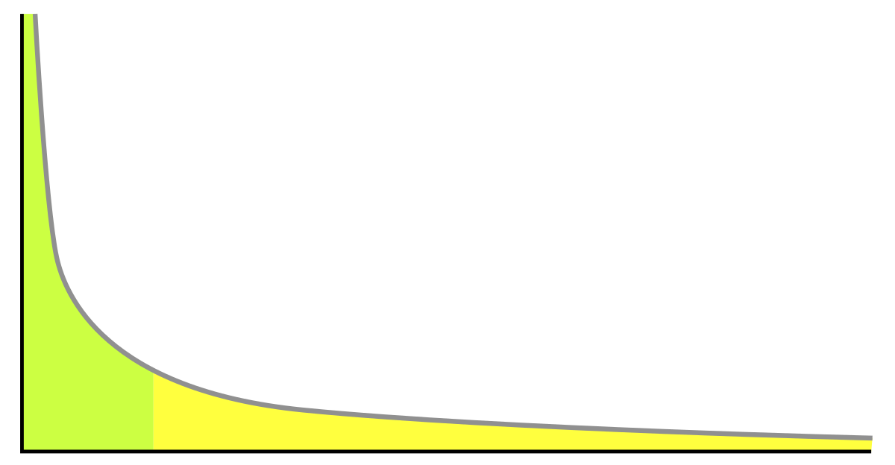
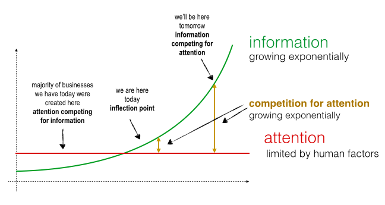
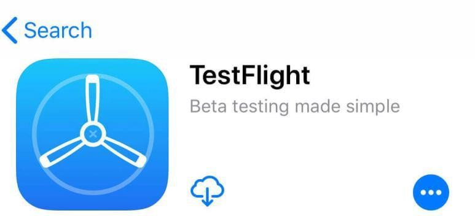
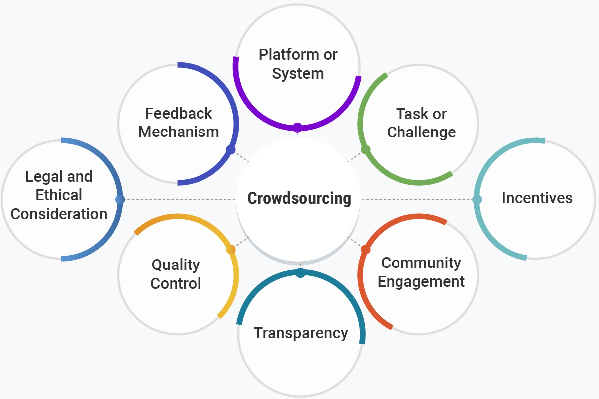
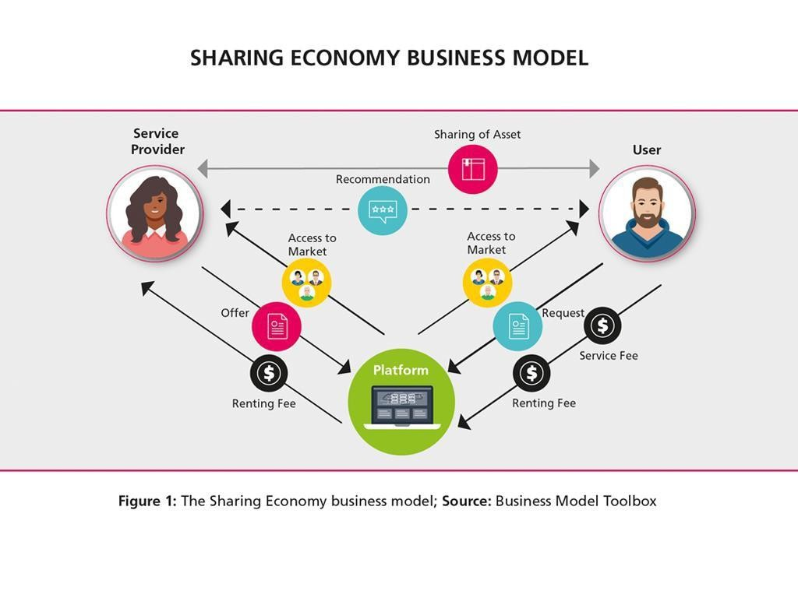

# 01-bevezetes

## Dia 1

- Bevezetés - A jog szerepe az információs társadalomban
- Dr. Grad-Gyenge Anikó, tanszékvezető habil. egyetemi docens
- Üzleti Jog Tanszék
- A slidesort készítette: Grad-Gyenge Anikó, Mezei Kitti

## Dia 2 — TELJESÍTÉSI FELTÉTELEK

- A félévközi jegy megszerzésének feltételei: Mindkét zárthelyin külön-külön el kell érni az
- összpontszám legalább 40 %-át. (VIK követelmény)
- A kurzushoz tartoznak önellenőrző kérdések, amelyeket a félév során kitölthetnek a hallgatók, ezek kitöltése a szorgalmi feladat. Pont akkor szerezhető, ha a teszten 5-ből legalább 4 tesztkérdésre hibátlan választ adott a hallgató.
- Kurzus koordinátor: Grad-Gyenge Anikó tanszékvezető (grad-gyenge.aniko@gtk.bme.hu)

| 2026-04-22, Sze | 18-20 |
| --- | --- |
| 2026-05-27, Sze | 18-20 |
| 2026-06-03, Sze | pótlási hét |

## Dia 3 — MENETREND

| Jogi alapismeretek - BMEGT55A405, péntek 10-13Három teremben párhuzamosan, átvetítéssel - IB028+IB027+IE007 |  |  |  |
| --- | --- | --- | --- |
| Hét | Témakörök | Előadó | Dátum |
| 1. | Bevezetés, a jog jelentősége a társadalomban, az információs társadalomban | Grad-Gyenge Anikó | 2026.02.20 |
| 2. | Az alapjogok védelme az információs társadalomban | Nagy Krisztina | 2026.02.27 |
| 3. | Adatvédelem | Puskás Tamás | 2026.03.06 |
| 4. | Üzleti működés formái | Badacsonyi Tegza | 2026.03.13 |
| 5. | Szellemi tulajdonjogok (szerzői jog) | Tomasovszky Edit | 2026.03.20 |
| 6. | Szellemi tulajdonjog (iparjogvédelem) | Tomasovszky Edit | 2026.03.27 |
| 7. | Tavaszi szünet |  | 2026.04.03 |
| 8. | Tavaszi szünet |  | 2026.04.10 |
| 9. | Elektronikus kereskedelem | Bárány Viktória Fanny | 2026.04.17 |
| 10. | Szerződések joga I. | Gondos Kitti | 2026.04.24 |
|  | Munka ünnepe |  | 2026.05.01 |
| 11. | Szerződések joga II. | Gondos Kitti | 2026.05.08 |
| 12. | Munkajog | Pap Péter | 2026.05.15 |
| 13. | Hírközlési jog | Nagy Krisztina | 2026.05.22 |
| 14. | Start up születik – szoftverfejlesztés és szerződések | Grad-Gyenge Anikó | 2026.05.29 |
| 15. | Pótlási hét |  | 2026.06.03 |

## Dia 4 — Információs társadalom?

## Dia 5 — INFORMÁCIÓS TÁRSADALOM

- Az „információs társadalom”kifejezés olyan társadalomra utal, amelyben az információ létrehozása, terjesztése, használata és manipulálása jelentős gazdasági, politikai és kulturális tevékenység.
- Az ilyen típusú társadalomban az információs és kommunikációs technológiák (IKT-k) központi
- szerepet játszanak a társadalmi, gazdasági és politikai élet szervezésében.
- Az információs társadalom fő jellemzői a következők:
- Az IKT-k mindent átható használata
- Az információ mint kulcsfontosságú erőforrás Hálózati társadalom
- Platformgazdaság Globalizáció
- Kulturális és társadalmi változások
- Az információ olyan feldolgozott, rendszerezett és kontextusba helyezett adatokra utal, amelyek
- felhasználhatók tudás létrehozására, döntések meghozatalára és tevékenységek irányítására.

## Dia 6 — INFORMÁCIÓS TÁRSADALOM

- Az információhoz való széleskörű hozzáférés
- internet, online platformok, okoseszközök
- Tudásalapú gazdaság
- digitális szolgáltatások és piacok térnyerése
- Technológiai infrastruktúra
- Digitális kompetencia
- Információcsere és együttműködés

## Dia 7 — AKTUÁLIS GAZDASÁGI JELENSÉGEK ÉS TRENDEK

- Ezek megmutatják, hogy hogyan változik meg:
- a kínálat (long tail),
- az információs, digitális termékek és szolgáltatások kezelése
- (figyelemgazdaság),
- a	kiszervezés,	tesztelés	vagy	finanszírozás	(crowdsourcing,	crowdtesting, crowdfounding),
- az árazás (freemium)
- és egyes termékek vagy szolgáltatások használata (sharing economy).

## Dia 8 — AKTUÁLIS GAZDASÁGI JELENSÉGEK ÉS TRENDEK

- Long tail
- A „long tail” a tömegtermékekről a hiánypótló termékek szélesebb választéka felé történő elmozdulást jelenti, amelyet a speciális érdeklődési körökre és igényekre szabott digitális platformok tesznek lehetővé. Az e-kereskedelemben szinte korlátlat árubőséggel lehet találkozni (például digitális piacterek, app stores, streaming-szolgálgatások stb.).
- Szabályozási kihívások:
- Piaci méltányosság: Annak biztosítása, hogy a kisebb, hiánypótló termékeket előállítók méltányos 	hozzáféréssel  rendelkezzenek a digitális platformokhoz,  és  ne kerüljenek  hátrányba  a nagyobb 	versenytársakkal szemben.
- Tartalommoderálás: A tartalom és a termékek széles körének szabályozása, beleértve az illegális, hamisított vagy káros tartalmak, illetve áruk értékesítésének megakadályozását, különös tekintettel 	az online térre.
- Szellemi tulajdon: A szellemi tulajdonjogok védelme, amikor	a hiánypótló termékek gyakran	a meglévő tartalmak újbóli összeállításával vagy újra felhasználásával járnak.

## Dia 9 — Long tail

## Dia 10 — AKTUÁLIS GAZDASÁGI JELENSÉGEK ÉS TRENDEK

- Figyelemgazdaság
- A	megnövekedett tartalom- és	információmennyiségnek köszönhetően
- a figyelemből hiány alakul ki. A
- figyelemgazdaságban	a	vállalkozások	versengenek	a	felhasználók	figyelméért,	gyakran	reklámok	vagy
- adatgyűjtés révén pénzzé téve azt.
- Szabályozási kihívások:
- Adatvédelem: Annak biztosítása, hogy a figyelemalapú modellek révén gyűjtött személyes adatokat az adatvédelmi jogszabályoknak, például a GDPR-nak megfelelően kezeljék.
- Mentális  egészség:  A  figyelemvezérelt  online  platformok  mentális  egészségre  gyakorolt  hatásával 	kapcsolatos  aggodalmak  kezelése,  különösen  a  függőséget  okozó  viselkedés  és  a  veszélyeztetett 	népességcsoportok     kitettségének     tekintetében     (például     gyermekek     és     idősek).
- Átláthatóság	és	manipuláció:	A	felhasználói	viselkedést	manipuláló	algoritmusok	használatának
- szabályozása, az átláthatóság biztosítása a tartalom ajánlása vagy megjelenítése tekintetében.

## Dia 11 — Figyelemgazdaság

**Előadói jegyzet:**
> https://www.hwsw.hu/hirek/57593/attention-economy-figyelemgazdasag-eroforras-termekfilozofia.html

## Dia 12 — CROWDSOURCING

- Crowdsourcing-nak több altípusa van:
  - Crowdtesting (a hazai Testflight),
  - Crowdfunding (Kickstarter).
- Gazdasági	jelentősége:	a
- „ingyen”	munkaerőhöz,
- segítségével
- tömeges
- szakértelemhez és más erőforrásokhoz (például tőkéhez, számítási kapacitáshoz stb.) juthatnak hozzá a vállalkozások.

## Dia 13 — Crowd-sourcing

**Előadói jegyzet:**
> https://ideascale.com/blog/what-is-crowdsourcing/

## Dia 14 — AKTUÁLIS GAZDASÁGI JELENSÉGEK ÉS TRENDEK

- Crowdsourcing
- Ezek a modellek az egyének kollektív hozzájárulására támaszkodnak a termékek fejlesztése, a szolgáltatások
- tesztelése vagy a kezdeményezések finanszírozása érdekében.
- Szabályozási kihívások:
- Munkajog: A crowdsourcingban vagy tömegtesztelésben részt vevő egyének jogainak és méltányos díjazásának
- védelme, akik nem feltétlenül rendelkeznek hagyományos munkavédelemmel.
- Fogyasztóvédelem: A crowdfunding platformok átláthatóságának és elszámoltathatóságának biztosítása a befektetők és a hozzájárulók védelme érdekében a csalással szemben.
- Szellemi tulajdon: A crowdsourcing révén létrehozott ötletekhez, termékekhez vagy tartalmakhoz kapcsolódó
- tulajdonjog és jogok tisztázása.

## Dia 15 — AKTUÁLIS GAZDASÁGI JELENSÉGEK ÉS TRENDEK

- Freemium
- A freemium modell az alapszolgáltatásokat ingyenesen kínálja, míg a prémium funkciókért díjat számít fel, és a bevételek
- generálása érdekében a feláras értékesítésre támaszkodik.
- Szabályozási kihívások:
- Fogyasztóvédelem: Annak biztosítása, hogy a fogyasztókat ne tévesszék meg az ingyenes szolgáltatások költségeivel
- vagy korlátaival kapcsolatban, és hogy a feláras értékesítési gyakorlat átlátható legyen.
- Verseny: Annak ellenőrzése, hogy a freemium modellek nem teremtenek-e tisztességtelen versenyt, különösen ha a nagy platformok piaci erejüket kihasználva olyan ingyenes szolgáltatásokat kínálnak, amelyeket a kisebb
- versenytársak nem engedhetnek meg maguknak.
- Adatvédelem: Azoknak a kérdéseknek a kezelése, amikor az ingyenes szolgáltatások „ára” a felhasználói adatok gyűjtése és pénzzé tétele, az adatvédelmi szabályoknak való megfelelés biztosítása.

## Dia 16 — A SHARING ECONOMY

- Sharing economy: olyan gazdasági és 	társadalmi  aktivitás  áll,  amely  online 	tranzakciókon  alapul,  és  segítségével 	megosztják  az  emberek  saját  vagy 	mások javait, szolgáltatásait.
- (Uber)
- vagy
- Lásd	autómegosztás lakásmegosztás (Airbnb),
- TaskRabbit.
- Számos szabályozási kérdést vet fel.

## Dia 17 — AKTUÁLIS GAZDASÁGI JELENSÉGEK ÉS TRENDEK

- Sharing economy
- Szabályozási kihívások:
- Munkajog és munkavállalói védelem: A tisztességes munkaügyi gyakorlatok biztosítása a platformgazdaságban (gig- gazdaságban) dolgozók számára, akik nem feltétlenül rendelkeznek a hagyományos munkaviszonyban dolgozók
- védelmével és előnyeivel.
- Fogyasztói biztonság és felelősség: A megosztott szolgáltatásokra vonatkozó biztonsági előírások és felelősségi kérdések szabályozása, biztosítva a fogyasztók védelmét, amikor magánszemélyek, nem pedig vállalkozások által nyújtott szolgáltatásokat vesznek igénybe.
- Adózás és megfelelés: A megosztáson alapuló gazdaságban keletkező jövedelmek adóztatásával kapcsolatos
- kihívások kezelése, amelyeket nehéz nyomon követni és betartatni, különösen a különböző joghatóságok között.
- Helyi szabályozás: A megosztáson alapuló gazdasági szolgáltatások és a helyi szabályozások, például az helyi
- jogszabályok, a szállodai előírások vagy a taxiengedélyek közötti konfliktusok kezelése.

## Dia 18

## Dia 19 — ONLINE PLATFORMOK

- A kereskedelem területén a 2000-es évek elején kezdett elterjedni az eBay, 	de még különlegesnek számított az online vásárlás.
- A közösségi média szolgáltatók közül példaként említhető a Facebook, 	amely  2004-ben  indult  el,  kezdetben  leginkább  a  fiatalabb  korosztály 	szabadidős tevékenységéhez kapcsolódott.
- A 2010-es évektől kezdve vált jelentőssé a platformok felfutása, váltak a 	mindennapi életünk részévé.
- Meghatározó információforrássá váltak, hirdetési felület, új foglalkozások, 	események befolyásolói (például választások).

## Dia 20 — A PLATFORM ALAPÚ GAZDASÁG JOGI VONATKOZÁSAI

- Az online platformok különféle formában és méretben léteznek;
- lefedik az online piacokat, keresőket,
- a közösségi médiát,
- alkalmazásokat forgalmazó platformokat,
- távközlési szolgáltatásokat,
- fizetési rendszereket (FinTech)
- és a közösségi gazdaság platformjait.

## Dia 21 — A PLATFORM ALAPÚ GAZDASÁG

- JOGI VONATKOZÁSAI
- A platformok növekvő szerepe és ereje szabályozási oldalról
- az alábbi problémákat veti fel:
- Igyekeznek kihasználni szűk keresztmetszet pozíciójukat profitmaximalizálásra (lásd területalapú korlátozások),
- Megváltoztatják a társadalmi viszonyokat (lásd fake news,	szűrőbuborék)	vagy	a	létező	piacokra
- gyakorolnak felforgató hatást (lásd sharing economy),
- Állam az államban viselkedés
- Súlyosan érintik az adatok védelmének kérdését

## Dia 22 — AZ ÚJ TECHNOLÓGIÁK ÁRNYOLDALA

- Az  új  technológiák  elterjedése  (pl.  internet,  mobilinformatikai,  IoT  eszközök használata) lehetőséget teremt a bűnözés eddig ismeretlen formái számára (pl. kiberbűnözés).
- Új típusú bűncselekmények megjelenése (hackertámadások, adatmanipulációk), illetve  a  hagyományos  bűncselekmények  is  könnyebben  elkövethetők  ezek segítségével (pl. csalás, zsarolás stb.).
- A technológiai környezet egyrészt a már létező társadalmi értékek új szféráját, másrészt egészen új a büntetőjog által védett értékeket hozott létre.

## Dia 23 — AZ ÚJ TECHNOLÓGIÁK ÁRNYOLDALA

- Kiterjedt online jelenlét, tömeges informatikai támadások megjelenése
- Az internet globálig jellege lehetőséget teremt a határon átívelő bűnözésnek
- Kommunikációs csatornát, illetve platformot biztosít
- Profit-orientált,	szolgáltatás	alapú	üzleti	modellé	vált	a	kiberbűnözés	(Darknet
- fórumok)
- Titkosítást és anonimitást biztosító technológiák (kriptovaluták, TOR)
- Magas látencia jellemzi a kiberbűncselekményeket
- Könnyedén végrehajtható adat-, programmanipuláció, automatizált műveletek

## Dia 24 — AZ ÚJ TECHNOLÓGIÁK ÁRNYOLDALA

- KIBERBŰNÖZÉS
- ún.	tisztán	informatikai	bűncselekmények	(pl.	számítógépes	vírusok,
- hacking)
- az információs rendszer és a számítógépes adat az elkövetés tárgya
- hagyományos	bűncselekmények	az	információs felhasználásával elkövetve (pl. csalás, zsarolás, zaklatás)
- - az információs rendszer az elkövetés eszköze
- rendszerek

## Dia 25 — GAZDASÁGI KIHÍVÁSOK

- A „győztes mindent visz piacok” kialakulása.
- Az internet használata kiszélesíti a földrajzi értelemben behatárolt piacokat,
- sokkal több piaci szereplőt hozva ezáltal versengő pozícióba.
  - A digitális termékek terjesztése szinte költségmentes, így az ilyen cégek
- mindenhol ott tudnak lenni.

## Dia 26 — A JOG ÉS A TECHNOLÓGIA KAPCSOLATA

- Technológia vs. jog
- Szabályozói foglyul ejtettség: a szabályozás előnyeit nem a köz, hanem a szabályozott élvezi, aki megpróbálja a szabályozót  a saját érdekei mentén befolyásolni (például digitális piacok terén, Meta és társai).
- Kihívások:
- A technológia felforgatja az addigi gazdasági, társadalmi
- viszonyokat,
- a technológiának valamilyen olyan jellemzője van, amely kihívást jelent a jogi szabályozás szempontjából (például feketedoboz hatás, pszeudoanonimitás stb.).
- Kockázatok megfelelő felmérése és kezelése
- Ex ante vs. ex post szabályozás

## Dia 27 — SZABÁLYOZÁSI KIHÍVÁSOK

- A jog szabályainak megerősítésére, a jogalkotási folyamat
- újragondolására lehet szükség.
- Az új technológiák a joggal szemben kettős elvárást támasztanak:
- biztosítani kell az emberi
- jogok védelmét
- a jog ne korlátozza a technológiai
- fejlődést
- Az ismeret hiánya a technológia szabályozásának legfőbb
- kihívása (pl. a technológia társadalmi elutasítottsága).

## Dia 28 — SZABÁLYOZÁSI KIHÍVÁSOK

- Kockázatalapú  megközelítéssel  lehet  megfelelő  jogi  választ  adni  a
- technológia szabályozás terén.
- Például az EU DSA (digitális szolgáltatásokról szóló rendelete) szerint minél  nagyobb  egy  online  platform,  annál  nagyobb   a  hatása,  és ennélfogva nagyobb kockázatot jelent a felhasználókra és a társadalomra nézve.
- Az EU mesterséges intelligencia rendelete különböző kockázati szintekbe sorolja az MI felhasználási eseteket.
- Emberi jogi hatásvizsgálat és adatvédelmi hatásvizsgálatok lefolytatása
- mint kockázatfelmérési eszköz (impact assessments).

## Dia 29 — SZABÁLYOZÁSI KIHÍVÁSOK

- „By  design”  megközelítés  (ethics  by  design,  regulation  by  design,  security  by design)
- A jogalkotók arra kötelezik a fejlesztőket, hogy biztosítsák, hogy a rendszer tervezése megfeleljen a konkrét jogi követelményeknek. A fejlesztők viszont úgy tesznek eleget ennek a követelménynek, hogy a jogi követelményeket műszaki  követelményekké alakítják  át,  amelyek  a  „regulation  by  design”  tartalmát  beágyazzák   a  digitális rendszer kódjába.
- Mesterséges intelligencia rendszerek
- Beépített adatvédelem elve (privacy by design)
- Algoritmikus kereskedési rendszerek

## Dia 30 — SZABÁLYOZÁSI SZINTEK

- Jog
- jogszabályok, bírósági és hatósági döntések
- „informatikai jog”, „infokommunikációs jog”
- Önszabályozás
- szakmai és iparági önszabályozás
- szabványosítás, domain, tartalomszabályozás
- Társszabályozás
- a hatósági jogalkalmazás és az önszabályozás összekapcsolása
- tartalomszabályozás
- „Kód”
- hálózati architektúra
- tartalomszűrés, hálózatsemlegesség

## Dia 31 — SZABÁLYOZÁSI SZINTEK

- Nemzetközi szabályozás
- EU-normák
- Nemzeti jogi
- szabályozás
- Iparági
- megállapodások
- Önszabályozó
- mechanizmusok
- Szerződési szabályok (általános szerződési feltételek)

## Dia 32 — SZABÁLYOZÁSI SZINTEK

- Az	információs	társadalom	szűkebb	jogrendszerébe	a	következő	jogterületek
- tartoznak:
- a magánjogon belül: az elektronikus kereskedelem joga, a versenyjog, a	digitális
- aláírás kérdése, a szerzői jog és iparjogvédelem.
- közjogi
- területen:	az	elektronikus	kormányzás	és	a	közigazgatási	eljárással
- kapcsolatos kérdések.
- vegyes	szakjogként:	információs	jogok,	melyekbe	az	adatvédelmi	jog	és	az
- információs szabadságjogok tartoznak, a médiajog.
- büntetőjogi	kérdések:	információs	rendszerek	elleni	bűncselekmények, tartalombűncselekmények.

## Dia 33

- KÖSZÖNÖM SZÉPEN A FIGYELMET!
