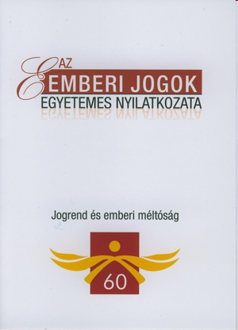
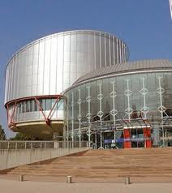
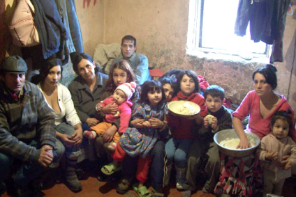
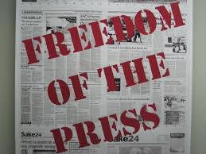
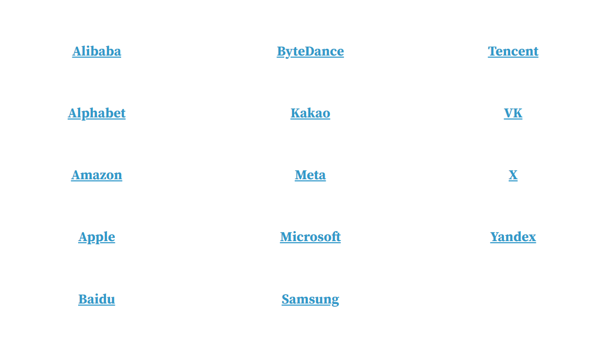
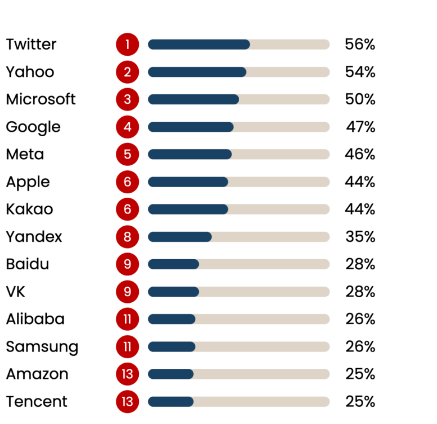
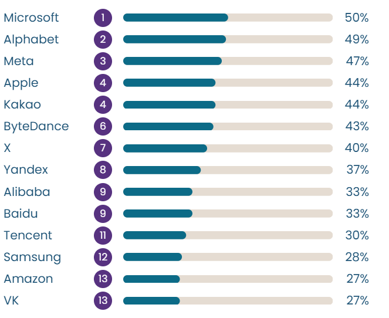

# 02-alapjogok

## Dia 1 — Jogi alapismeretek

- Jogi alapismeretekAz alapjogok VÉDELME AZ  INFORMÁCIÓS TÁRSADALOMBAN 2. előadás
- Nagy Krisztina
- Budapesti Műszaki Egyetem
- Gazdaság- és Társadalomtudományi Kar
- Üzleti Jog Tanszék
- 2026. Február 27.

## Dia 2 — Az alapjogok jelentősége az online környezet szabályozásában

- 1.  Alapjogok - fogalmi alapozás
- Az alapjogok védelmének rendszere
- A véleménynyilvánítás szabadsága
- 4.  Az információs társadalomban az alapjogok érvényesítésével kapcsolatban felmerülő kihívások
  - a technológiai környezet fejlődésével megjelenő társadalmi kockázatok
  - alapjogok védelme a digitális környezetben - aktuális helyzetkép, a szabályozás iránya

## Dia 3

- Beszélgetés párban:
- Mi az a szó, gondolat, ami eszébe jut, ha azt hallja: alapvető jogaim az online térben?
- Találkozott-e már olyan helyzettel a digitális térben, amikor úgy érezte, hogy alapjoga sérült?

## Dia 4

- https://www.youtube.com/watch?v=nDgIVseTkuE

## Dia 5 — Alapvető emberi jogok - alapjogok

- Emberi jogok:
- Az egyén és az állam közötti viszony döntő tényezői. Mindenkit megillető veleszületett, sérthetetlen, elidegeníthetetlen jogosultságok, amelyeket az állam nem adományoz, hanem elismer és tiszteletben tart.
- Az emberi jogok szerepe:
- védelmet biztosítsanak az egyének számára az állami beavatkozásokkal szemben
- az emberek szabadon vehessenek részt a társadalmi életben és a különböző politikai folyamatokban
- biztosítják az emberek számára a saját élet, életmód meghatározását.
- Alapjogok:
- Az egyes államok alkotmányaiban és a különböző nemzetközi emberi jogi egyezményekben felsorolt és ezáltal a tételes jog részévé tett emberi jogok.

## Dia 6

- Állami kötelezettségek az emberi jogokkal összefüggésben

## Dia 7

- Az emberi jogok generációi
- Első generációs jogok (személyi és politikai szabadságjogok)
- Ezek ún. „szabadságorientált” jogok, amelyek a következőket foglalják magukban: az egyén élethez, szabadsághoz, biztonsághoz való joga, kínzás, rabszolgaság tilalma, politikai részvétel, vélemény-, gondolat-, lelkiismeret-, vallásszabadság, egyesülés és gyülekezés szabadsága. (Szabadság)
- 2.    Második generációs jogok (gazdasági, szociális és kulturális jogok.)
- Ezek ún. „biztonságorientált” jogok, amelyek többek között az alábbiakat
- foglalják  magukban: munkához, oktatáshoz való jog, elfogadható
- életszínvonalhoz, élelemhez, egészségügyi ellátáshoz való jog, tudományos
- kutatás szabadsága. (Egyenlőség)
- Harmadik generációs jogok (globális problémákkal összefüggő jogok)  Ilyen például egy olyan környezetben való éléshez való jog, amely tiszta és pusztítástól védett, valamint a kulturális, politikai és gazdasági fejlődéshez való jog. (Szolidaritás)

## Dia 8

- Az emberi jogok nemzetközi védelme
- Alapvető jogforrások:
- Emberi Jogok Egyetemes Nyilatkozata (1948) – ENSZ
- Polgári és Politikai Jogok Nemzetközi Egyezségokmánya (1966) – ENSZ
- Gazdasági, Szociális és Kulturális Jogok Nemzetközi Egyezségokmánya (1966) – ENSZ
- Egyezmény az Emberi Jogok és Alapvető Szabadságjogok Védelméről
- (Emberi Jogi Európai Egyezménye) (1950) - Európa Tanács

## Dia 9 — Emberi jogok érvényesítésének nemzetközi fóruma Európában  - Európai Emberi Jogi Bíróság (Strasbourg)

- Ítélkezés alapja: az Emberi Jogok Európai Egyezménye.
- Eljárás indítására jogosultság:
- áldozati státusz
  - eljárást indíthat: sérelmet szenvedett személy vagy hozzátartozó, aki kimerítette az összes hazai jogérvényesítési, jogorvoslati lehetőséget
- a sérelem az egyezmény által védett jogot érinti
- Jogkövetkezménye:
- Igazságos elégtétel vagy kártérítés megítélése a sértett számára.
- Nem kötelezheti az országokat a szabály megváltoztatására, ahogy nem változtathatja meg a hazai bíróságok ítéleteit sem.
- Legfontosabb eszköze a nyilvánosság
- A tagállami jogalkalmazás, bíróségi joggyakorlat alakítása

## Dia 10

- Jogeset
- Szurovecz v. Hungary15428/16(2019.)
- A strasbourgi bírósági eljárás magyar eljárási előzménye, hogy 2015-ben az abcug.hu egyik újságírójától a magyar hatóságok megtagadták a belépést a debreceni menekülttáborba.  A hatóság az elutasításban a menekülők magánélethez való jogának védelmére hivatkozott, valamint arra, hogy sokan üldözés elől menekültek, és az ő hollétük nyilvánosságra kerülése az ő és a családjuk biztonságát is veszélyeztetheti.
- Az újságíró a strasbourgi bírósághoz fordult a véleménynyilvánítás szabadságának korlátozása miatt.
- Egyezmény 10. cikk
- Mindenkinek joga van a véleménynyilvánítás szabadságához. Ez a jog magában foglalja a véleményalkotás szabadságát és az információk, eszmék megismerésének és közlésének szabadságát országhatárokra tekintet nélkül és anélkül, hogy ebbe hatósági szerv beavatkozhasson.

## Dia 11

- A strasbourgi bíróság kimondta, hogy  Magyarország a hatósági eljárással megsértette a véleménynyilvánítás szabadságát.
- A bíróság döntése alapján ugyan a tagállamok hatóságai jogszabályi felhatalmazás alapján eldönthetik hogyan biztosítják a sajtó menekülttáborokba való belépését, de a közérdek mérlegelése nélkül nem lehet általában megtiltani a sajtó belépését.
- Indokolás
- Az újságíró nem szenzációhajhász cikket szeretett volna készíteni, és elsősorban nem is az egyes menedékkérők személyét szerette volna bemutatni, hanem a magyar hatóságok által biztosított körülményeket.
- A belépést megtiltó állami hatóság nem vette figyelembe, hogy az újságíró vállalta, hogy csak előzetes (akár írásbeli) hozzájárulás esetén készít fényképet menedékkérőkről.

## Dia 12

- A bíróság nem fogadta el a magyar kormány azon érvét, hogy az újságíró más forrásokból is tudott információt szerezni, például civil szervezetek jelentéseiből, mivel  a bíróság szerint a közvetett adatoknak nincs olyan meggyőző ereje a nyilvánosság szemében, mint az elsőkézből származó információnak, illetve a civil szervezetek és más szereplők értelemszerűen részben mást tartanak relevánsnak, mint egy újságíró.
- A bíróság értékelése szerint a szólásszabadság nemcsak a gondolatok tartalmát, hanem azok közlési módját is védi. Sem a tagállami hatóságok és bíróságok, sem a Bíróság nem vizsgálhatja felül, hogy egy újságíró milyen eszközzel és milyen formában kíván bemutatni egy ügyet.
- A bíróság emellett azt is figyelembe vette, hogy az újságíró számára nem állt rendelkezésre megfelelő jogorvoslati lehetőség a hatóság döntésével szemben.
- A bíróság kifogásolta, hogy a  magyar hatóság nagyon röviden és sommásan indokolt és nem mérlegelte a különböző érdekeket és abszolút tilalmat rendelt el, vagyis általában tiltotta meg a belépést.  A konkrét ügyben a bíróság nem látta igazoltnak a kényszerű társadalmi szükséglet fennállását, ami szükséges feltétele az alapjog korlátozásának.

## Dia 13

- Az alapjogok védelmének rendszere
- Korlátozhatóak-e az alapvető jogok?
- Az alapvető jogokra és kötelezettségekre vonatkozó szabályokat törvény állapítja meg.
- Alapvető jog más alapvető jog érvényesülése vagy valamely alkotmányos érték védelme érdekében, a feltétlenül szükséges mértékben, az elérni kívánt céllal arányosan, az alapvető jog lényeges tartalmának tiszteletben tartásával korlátozható.
- (Alaptörvény)

## Dia 14

- Alaptörvény
- Az emberi méltóság sérthetetlen. Minden embernek joga van az élethez és az emberi méltósághoz, a magzat életét a fogantatástól kezdve védelem illeti meg.
- Senkit nem lehet kínzásnak, embertelen, megalázó bánásmódnak vagy büntetésnek alávetni, valamint szolgaságban tartani.
- Mindenkinek joga van a szabadsághoz és a személyi biztonsághoz.
- A törvény előtt mindenki egyenlő. Minden ember jogképes.
- Magyarország az alapvető jogokat mindenkinek bármely  megkülönböztetés, nevezetesen faj, szín, nem, fogyatékosság, nyelv, vallás, politikai vagy más vélemény, nemzeti vagy társadalmi származás, vagyoni, születési vagy egyéb helyzet szerinti különbségtétel nélkül biztosítja.

## Dia 15

- Magyarország külön intézkedésekkel védi a gyermekeket, a nőket, az időseket és a fogyatékkal élőket.
- Minden gyermeknek joga van a megfelelő testi, szellemi és erkölcsi fejlődéséhez szükséges védelemhez és gondoskodáshoz.
- Mindenkinek joga van ahhoz, hogy magán- és családi életét, otthonát, kapcsolattartását és jó hírnevét tiszteletben tartsák.
- Mindenkinek joga van személyes adatai védelméhez, valamint a közérdekű adatok megismeréséhez és terjesztéséhez.
- Mindenkinek joga van ahhoz, hogy az ellene emelt bármely vádat vagy valamely perben a jogait és kötelezettségeit törvény által felállított, független és pártatlan bíróság tisztességes és nyilvános tárgyaláson, ésszerű határidőn belül bírálja el.

## Dia 16

- Mindenkinek joga van a gondolat, a lelkiismeret és a vallás szabadságához.
- Ez a jog magában foglalja a vallás vagy más meggyőződés szabad megválasztását vagy megváltoztatását és azt a szabadságot, hogy vallását vagy más meggyőződését mindenki vallásos cselekmények, szertartások végzése útján vagy egyéb módon, akár egyénileg, akár másokkal együttesen, nyilvánosan vagy a magánéletben kinyilvánítsa vagy kinyilvánítását mellőzze, gyakorolja vagy tanítsa.
- Mindenkinek joga van a békés gyülekezéshez.
- Mindenkinek joga van szervezeteket létrehozni, és joga van szervezetekhez csatlakozni.
- Mindenkinek joga van a véleménynyilvánítás szabadságához.
- Magyarország elismeri és védi a sajtó szabadságát és sokszínűégét, biztosítja a demokratikus közvélemény kialakulásához szükséges szabad tájékoztatás feltételeit.
- Magyarország biztosítja a tudományos kutatás és művészeti alkotás szabadságát, továbbá – a lehető legmagasabb szintű tudás megszerzése érdekében – a tanulás, valamint törvényben meghatározott keretek között a tanítás szabadságát.

## Dia 17

- Kahoot.it

## Dia 18

- A véleménynyilvánítás szabadsága védelmének az újmédia környezetben is kitüntetett szerepe van. A véleménynyilvánítás szabadságát biztosító korábbi jogi eszközök, megoldások már nem adnak minden esetben megfelelő válaszokat az új médiakörnyezet felmerülő kérdésekre, problémákra.
- A véleménynyilvánítás szabadsága

## Dia 19

- A véleménynyilvánítás szabadsága
- Emberi Jogok Európai Egyezménye
- 10. Cikk
- Véleménynyilvánítás szabadsága
- 1.Mindenkinek joga van a véleménynyilvánítás szabadságához. Ez a jog magában foglalja a véleményalkotás szabadságát és az információk, eszmék megismerésének és közlésének szabadságát országhatárokra tekintet nélkül és anélkül, hogy ebbe hatósági szerv beavatkozhasson. Ez a Cikk nem akadályozza, hogy az államok a rádió-, televízió- vagy mozgókép vállalatok működését engedélyezéshez kössék.

## Dia 20

- Alaptörvény IX. cikk - Véleménynyilvánítás szabadsága, sajtószabadság
- (1) Mindenkinek joga van a véleménynyilvánítás szabadságához.
- (2) Magyarország elismeri és védi a sajtó szabadságát és sokszínűségét, biztosítja a demokratikus közvélemény kialakulásához szükséges szabad tájékoztatás feltételeit.
- (3)A demokratikus közvélemény kialakulásához választási kampányidőszakban szükséges megfelelő tájékoztatás érdekében politikai reklám médiaszolgáltatásban kizárólag ellenérték nélkül, az esélyegyenlőséget biztosító, sarkalatos törvényben meghatározott feltételek mellett közölhető.
- (4) A véleménynyilvánítás szabadságának a gyakorlása nem irányulhat mások emberi méltóságának a megsértésére.
- (5) A véleménynyilvánítás szabadságának a gyakorlása nem irányulhat a magyar nemzet, a nemzeti, etnikai, faji vagy vallási közösségek méltóságának a megsértésére. Az ilyen közösséghez tartozó személyek - törvényben meghatározottak szerint - jogosultak a közösséget sértő véleménynyilvánítás ellen, emberi méltóságuk megsértése miatt igényeiket bíróság előtt érvényesíteni.
- (6)A sajtószabadságra, valamint a médiaszolgáltatások, a sajtótermékek és a hírközlési piac felügyeletét ellátó szervre vonatkozó részletes szabályokat sarkalatos törvény határozza meg.

## Dia 21

- A véleményszabadság korlátozása
- Alapjogok összeütközése esetén, valamelyik ütköző jog korlátozására van szükség.
- A véleményszabadságnak kitüntetett szerepe miatt csak kevés joggal szemben kell engednie.
- „Alapvető jog más alapvető jog érvényesülése vagy valamely alkotmányos érték védelme érdekében, a feltétlenül szükséges mértékben, az elérni kívánt céllal arányosan, az alapvető jog lényeges tartalmának tiszteletben tartásával korlátozható.” (Alaptörvény)

## Dia 22

- A véleményszabadság korlátozása

## Dia 23

- Hol húzódnak a véleményszabadság határai?
- Közlések, amelyek
- sértik meghatározott személyek emberi méltóságát, személyiségi jogait, magánéletét,
- meghatározott társadalmi csoportokkal szemben gyűlöletet keltenek, hozzájárulnak az adott csoport kirekesztéséhez, megfélemlítéséhez,
- szexuális és erőszakos tartalmak, szerencsejáték, de akár rossz konfliktuskezelési, együttélési mintákat közvetítő tartalmak káros hatással lehetnek a gyerekekre, azok fejlődésére . Az ilyen jellegű közlések a felnőttek számára jogszerűen elérhetők, de úgy kell őket közzétenni, hogy a gyerekek ahhoz nagy valószínűséggel ne férhessenek hozzá,
- veszélyeztetik a társadalom egészének olyan érdekeit, mint a közbiztonság vagy a közegészség,
- tisztességtelen eszközökkel igyekeznek befolyásolni a fogyasztói döntéseket,
- valamely mű szerzőjének, a tartalom előállítójának üzleti érdekeit sértik, a szellemi alkotások védelmére vonatkozó szabályok figyelmen kívül hagyásával.

## Dia 24

- Példa a véleménynyilvánítás szabadságának jogi korlátozására –
- Reklámozásra vonatkozó szabályok
- A kereskedelmi közleményt (reklámot) is védi a  véleménynyilvánítás szabadsága, de más alapjogok és alkotmányos követelmények védelme érdekében a véleménynyilvánítás szabadsága korlátozható.
- A kereskedelmi közleményeket a fogyasztók védelme érdekében jogszabályban korlátozhatja a törvényalkotó.
- A jogi korlátot Magyarországon például a
- A fogyasztókkal szembeni tisztességtelen kereskedelmi gyakorlat tilalmáról szóló 2008. évi XLVII. Törvény (Fttv.) fogalmazza meg.
- A törvényben meghatározott kereskedelmi gyakorlatok tisztességtelenek, és jogsértésként értékeli őket a hatóság.
- .

## Dia 25

- Nézzük a konkrét jogi szabályt!
- A Fttv. „Feketelistájának” 11. pontja szerint tisztességtelen kereskedelmi gyakorlatnak minősül az írott vagy elektronikus médiában szerkesztői tartalom használata az áru értékesítésének vagy más módon történő igénybevételének előmozdítására úgy, hogy ezért a vállalkozás ellenszolgáltatást nyújtott, ez azonban nem tűnik ki egyértelműen a tartalomból vagy a fogyasztó számára egyértelműen felismerhető képi vagy akusztikus elemekből (szerkesztői tartalomnak álcázott reklám).
- A hatóság ezt a törvényhelyet alkalmazza abban az esetben, ha egy influenszer nem tájékoztat a közösségi média posztban arról, hogy ellenszolgáltatást kapott a posztban szereplő termék megjelenítéséért.

## Dia 26

- Jogeset
- Influenszerek Facebook oldalain megjelenő reklámok, szponzorált üzenetek.
- Korábban meglévő jogszabály alkalmazása a digitális térben megjelenő új kereskedelmi gyakorlatra. Gazdasági Versenyhivatal joggyakorlata.

- 2016-ban 3 versenyfelügyeleti eljárást (VJ/110/2016., VJ/111/2016., VJ/112/2016.) is indított „influencer”-ek (véleményvezérek) Facebook, illetve Instagram oldalain megjelent posztok kapcsán. Valószínűsíthető volt, hogy az „influencer”-ek ellenszolgáltatásban részesültek a posztokért, azonban ezt nem közölték az influenszerek.

## Dia 27

- GVH által kialakított joggyakorlat:
- „A GVH szerint akkor tekinthető jogszerűnek egy magánszemély (legyen az közszereplő, véleményvezér, youtuber, blogger, vlogger) közösségi oldalán írt posztjainak sorában megjelenő fizetett (azaz, ellentételezett) tartalom, ha abban
- egyszerűen, egyértelműen, közérthetően,
- jól észlelhetően, hangsúlyosan, a fogyasztók számára szembetűnően jelenik meg, hogy
- az nem független, semleges vélemény vagy ajánlás, hanem ellenszolgáltatás vagy egyéb közvetlen gazdasági érdek (is) áll mögötte, ide értve azokat az eseteket is,
- amikor az oldal fenntartója, a magánszemély kedvezményt, ajándékot vagy szolgáltatást kap a posztért, azaz, az ajánlásért cserébe, valamint azt is,
- ii. ha valaki saját vállalkozását vagy vállalkozásának termékét reklámozza (amennyiben ez a kapcsolat nem derül ki a kereskedelmi gyakorlatból, illetve nem is köztudott).”

## Dia 28

## Dia 29

- Meta hirdetési szabályzata
- https://transparency.meta.com/policies/ad-standards/
- Korlátozza-e szabályzattal a Meta a felhasználók véleménynyilvánítás szabadságát?
- Tartalmaz-e szabályt a Meta hirdetési szabályzata a termékmegjelenítés jelzésére?
- Milyen termékeket nem reklámozhatnak a felhasználók
- (pl. influenszerek)?

## Dia 30

- Az emberi jogok védelme a digitális környezetben
- Az emberi jogok védelme a globális kommunikációs térben összetett felelősségi rendszerben helyezhető el, amelynek alapja és kiindulópontja, hogy az emberi jogok védelme tradicionálisan az államok kötelezettsége, az alapjogokat rögzítő nemzetközi egyezmények pedig a részes államokat kötik.
- Az ENSZ Emberi Jogi Bizottságának 2011-ben megfogalmazott Guiding Principles on Business and Human Rights című dokumentuma globális referenciapontként rögzíti az alapvető emberi jogok és az üzleti világ kapcsolatának elvi alapjait, és megoldási keretet kínál a globális gazdaság  kialakulásával összefüggő alapjogi kihívásokra.
- Az alapvető emberi jogok online térben való védelmével összefüggésben az ENSZ Emberi Jogi Bizottsága rögzítette, hogy „az embereket az offline világban megillető jogok ugyanúgy védelem alatt állnak az online környezetben is”. (United Nations Human Rights Council  The promotion, protection and enjoyment of human rights on the Internet A/HRC/RES/20/8 16/07/2012.)

## Dia 31

- Az interneten működő globális szolgáltatók (pl. keresőmotor szolgáltatók, közösségi médiaplatformok) tevékenysége komplex módon érinti az alapvető emberi jogok érvényesülését.
- Az ENSZ Guiding Principles on Business and Human Rights c. dokumentuma a „Protect, Respect, and Remedy” keretrendszerének három pillérére építve határozza meg a tagállamok és a vállalatok elkülönülő, de egymást kiegészítő feladatait az emberi jogok védelmével összefüggésben.

## Dia 32 — Nemzetközi védelem - Guiding Principles on Business and Human Rights

## Dia 33

- Az emberi jogok védelme a digitális környezetben - Európai Unió
- A digitális átalakulás felgyorsulásával elérkezett az idő arra, hogy az EU megfogalmazza, hogyan kívánja érvényre juttatni a digitális környezetben az offline térben alkalmazandó értékeit és az általa az offline térben biztosított alapvető jogokat. A digitális átalakulás nem járhat visszalépéssel a jogok területén. Ami az offline térben jogellenes, az az online térben is az. (Európai nyilatkozat a digitális évtizedben érvényre juttatandó digitális jogokról és elvekről (2023/C 23/01)
- Az információs társadalomban az emberi jogok védelme a meglévő jogintézmények mellett új szabályozási megoldásokat, eszközöket igényel.
- Az Európai Unióban ezt célozza a GDPR (adatvédelmi szabályozás), vagy a Digitális szolgáltatási rendelet (DSA) (többek között online platformok szabályozása) elfogadása.

## Dia 34

- Forrás: https://rankingdigitalrights.org/index2020

## Dia 35

- RDR 2025 – 14 nagyvállalat 43 platformjának értékelése

## Dia 36

- 2022 Big Tech RDR Index

- 2025 Big Tech RDR Index

## Dia 37

- RDR Index kategóriák
- 2020-ban két fontos szemponttal egészült ki az értékelés: az algoritmusok és a személyre szabott reklámozás működésének nyilvánossága.

## Dia 38

- RDR Index 2025 – egyes rendszerszintű problémák
- Emberi jogi hatásvizsgálatok hiánya, különösen a célzott hirdetésekre vonatkozóan
- A nagy platformok nem végeznek rendszeres, átfogó emberi jogi hatásvizsgálatot azzal kapcsolatban, hogy a belső szabályzataik, valamint a célzott hirdetésekre épülő működésük hogyan befolyásolja a felhasználók szólásszabadsághoz, a magánélethez és a megkülönböztetésmentességhez való jogát.
- 2) A célzott hirdetési üzleti modell átláthatatlansága és végrehajtási hiányai
- 11 vállalat nem hozott nyilvánosságra információt a hirdetési tartalmi irányelvek megsértése miatt eltávolított hirdetésekről, és nem hozott nyilvánosságra bizonyítékot a hirdetéscélzási irányelveik betartatására vonatkozóan. (Kivételek: Alibaba, az Alphabet és a ByteDance)
- 3) Tartalommoderálás: saját szabályzatokok végrehajtásának átláthatatlansága
- A vállalatok gyakran csak a felhasználókra vonatkozó szabályokat (pl. Meta Közösségi Alapelvek) közlik, de azt nem, hogyan alkalmazzák ezeket: kevés, töredezett és szolgáltatásonként eltérő adat érhető el, és a korábbi, ezen a területen jobban működő cégek is megrekedtek ezen a téren.​

## Dia 39

- Az ENSZ Guiding Principles on Business and Human Rigths azt az elvárást fogalmazza meg a vállaltok felé, hogy tevékenységükkel kapcsolatban emberi jogi átvilágítást végezzenek. Ez magában foglalja a tényleges és potenciális emberi jogi hatások felmérését, valamint ezen hatásokra adott megfelelő reakciókat.
- Az emberi jogi hatásvizsgálat (HRIA) elemzi azokat a hatásokat, amelyeket az üzleti tevékenységek gyakorolnak az egyénekre, például a munkavállalókra, a helyi közösség tagjaira, a fogyasztókra és másokra.
- Az alábbi rövid videó bemutatja a hatásvizsgálat egyes elemeit:
- https://www.youtube.com/watch?v=46Too_X_RjA
- Nemzetközi védelem - Guiding Principles on Business and Human Rights

## Dia 40

- EURÓPAI UNIÓ – JOGFEJLESZTÉS
- AZ ALAPJOGOK VÉDELME ÉRDEKÉBEN A DIGITÁLIS TÉRBEN
- https://www.youtube.com/watch?v=cOIKo8TGPyw
- EGYÜTTES NYILATKOZATOK EURÓPAI PARLAMENT TANÁCS EURÓPAI BIZOTTSÁG
- Európai nyilatkozat a digitális évtizedben érvényre juttatandó digitális jogokról és elvekről (2023/C 23/01)

## Dia 41 — Célok, elvek az Európai Unióban

- EGYÜTTES NYILATKOZATOK EURÓPAI PARLAMENT TANÁCS EURÓPAI BIZOTTSÁG Európai nyilatkozat a digitális évtizedben érvényre juttatandó digitális jogokról és elvekről (2023/C 23/01)
- Részvétel a digitális nyilvános térben
- 12. Mindenki számára biztosítani kell a megbízható, sokszínű és többnyelvű digitális környezethez való hozzáférést. A sokszínű tartalmakhoz való hozzáférés elősegíti a plurális nyilvános vitát és a demokráciában való tényleges, megkülönböztetéstől mentes részvételt.
- 13. Mindenkinek joga van a digitális környezetben a véleménynyilvánítás és a tájékozódás szabadságához, valamint a gyülekezés és az egyesülés szabadságához.
- 14. Mindenkinek képesnek kell lennie hozzáférni az azzal kapcsolatos információkhoz, hogy kinek a tulajdonában vannak, illetve kinek az ellenőrzése alatt állnak az általa igénybe vett médiaszolgáltatások.
- 15. Az online platformoknak, különösen az online óriásplatformoknak támogatniuk kell a szabad demokratikus vitát az online térben. Tekintettel az általuk nyújtott szolgáltatásoknak a közvélemény és a közbeszéd alakításában betöltött szerepére, az online óriásplatformoknak csökkenteniük kell a szolgáltatásaik működéséből és használatából eredő – többek között a félretájékoztatási és dezinformációs kampányokkal kapcsolatos – kockázatokat, és védeniük kell a véleménynyilvánítás szabadságát.

## Dia 42

- Elkötelezzük magunkat amellett, hogy:a)továbbra is megvédjük az összes alapvető jogot az online térben, különösen a véleménynyilvánítás és a tájékozódás szabadságát, ezen belül is a tömegtájékoztatás szabadságát és sokszínűségét;c)arányos intézkedéseket hozzunk annak érdekében, hogy küzdjünk a jogellenes tartalmak valamennyi formája ellen, maradéktalanul tiszteletben tartva az alapvető jogokat, köztük a véleménynyilvánítás és a tájékozódás szabadságához való jogot, és anélkül, hogy általános nyomonkövetési kötelezettségeket vagy cenzúrát vezetnénk be;d)olyan digitális környezetet alakítsunk ki, ahol az emberek védve vannak a dezinformációval és az információmanipulációval, valamint a káros tartalmak egyéb formáival szemben, beleértve a zaklatást és a nemi alapú erőszakot is;f)lehetővé tegyük az egyének számára, hogy szabadon hozhassanak meghatározott döntéseket, valamint korlátozzuk a sebezhetőségeknek és az elfogultságnak az elsősorban célzott hirdetések révén történő kihasználását.

## Dia 43 — Kockázatértékelés a szabályozásban

## Dia 44

- Források:
- United Nations – Guiding Principles on Business and Human Rights. 2011. http://www.ohchr.org/Documents/Publications/GuidingPrinciplesBusinessHR_EN.pdf
- EGYÜTTES NYILATKOZATOK EURÓPAI PARLAMENT TANÁCS EURÓPAI BIZOTTSÁG Európai nyilatkozat a digitális évtizedben érvényre juttatandó digitális jogokról és elvekről (2023/C 23/01)
- https://eur-lex.europa.eu/legal-content/HU/TXT/PDF/?uri=CELEX:32023C0123(01)
- Ranking Digital Rights
- https://rankingdigitalrights.org/
- Wessenauer Veszna: Átláthatóság, társadalmi igazságosság és emberi jogok – szempontok a digitális platformok szabályozásához
- https://www.politicalcapital.hu/kereses.php?article_read=1&article_id=2826
