# 05-szerzoi-jog

## Dia 1 — Szellemi alkotások joga

- Szellemi alkotások jogaSzerzői jog
- Dr. Tomasovszky Edit
- BME GTK ÜJT
- 2026.03.20.

## Dia 2 — Mi minden lehet Szerzői mű?

## Dia 3 — Az előadás rövid áttekintése

- A szerzői jogi védelem általános sajátosságai, a funkcionális alkotások szerepe
- A szoftverek jogi védelméről
- Az adatbázis jogi védelméről

## Dia 4 — Szellemi alkotások joga

## Dia 5 — OLTALMI FORMÁK

|  | MIT VÉD? | OLTALOMKÉPESSÉG FELTÉTELEI | OLTALMI IDŐ |
| --- | --- | --- | --- |
| SZABADALOM | Műszaki megoldás | Újdonság; Feltalálói tevékenység; Ipari alkalmazhatóság | 20 év |
| VÉDJEGY | Vállalat márkeneve, logója, szlogenje stb. | Ábrázolható megjelölés; Megkülönböztető képesség | 10-10 év (korlátlanul megújítható) |
| FORMATERVEZÉSI MINTA | Termék megjelenése, csomagolása, dizájnja | Egyéni minta; Korábbi mintáktól eltérő összbenyomás | 5-5 év (max. 25 évig fenntartható) |
| SZERZŐI JOG | Művészet, irodalom, tudomány területén alkotott művek; Funkcionális alkotások (szoftver, adatbázis) | Egyéni-eredeti jelleg | Szerző élete + 70 év (kivételek) |

- OlTALMI FORMÁK

## Dia 6 — Mi nem számít?

- Mennyiség
- Minőség
- Esztétikai érték
- Művészeti stílus
- Alkotás színvonalára vonatkozó értékítélet

## Dia 7 — Néhány példa

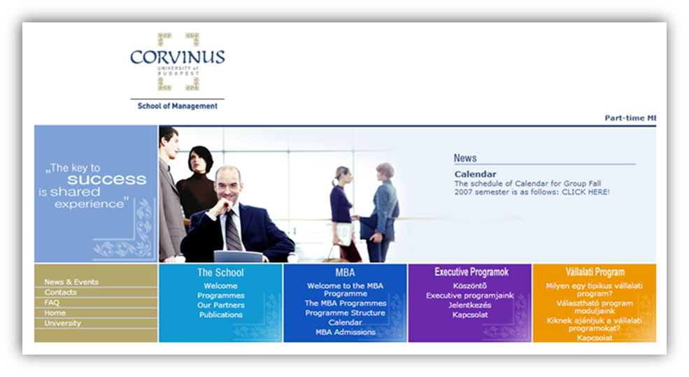

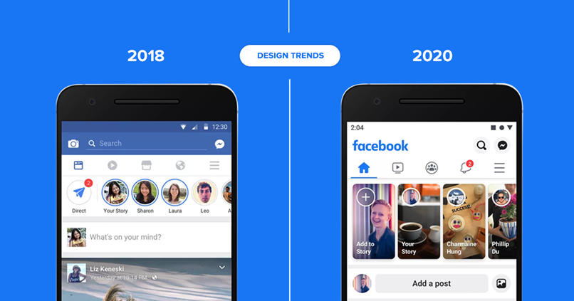

## Dia 8 — kizárások

- 1. Folklór
  - szerző, keletkezés ismeretlen
- 2. Ötlet, elv, eljárás, matematikai művelet
  - nem éri el a védelem formai minimumát
  - Ötlet pl. zene: hang, ritmus, akkordmenetek; TV: élő show „plot”
- 3. Jogszabályok, közjogi szervezetszabályozó eszközök, a bírósági vagy hatósági határozatok, a hatósági vagy más hivatalos közlemények és ügyiratok, valamint más hasonló rendelkezések
- - társadalmi érdekből kizárt (információhoz való hozzáférés)
- 4. Sajtóközlemények alapjául szolgáló hírek, tények

## Dia 9 — A funkcionális alkotások védelmének fejlődése

- Az oltalom dilemmái az 1970-es években - mára eldőltek, de máig ható megközelítésbeli viták
- USA - európai szabadalmi megközelítés különbsége (technika-fogalom eltérése) patent approach/copyright approach/hybrid approach
- Fontos szempont: befektető/vállalkozás védelmének elismerhetősége
- Ma: a kikristályosodott oltalmi formák egyenként nem alkalmasak teljes körben a védelemre - körkörös védelem: titokvédelem, szerződések, kizárólagos jogok

## Dia 10 — Szerzői jog

- Szabadalom

| Regisztrációval keletkezik (kevésbé az alkotóhoz kötött) | Alkotással keletkezik (jobban az alkotóhoz kötött) |
| --- | --- |
| Műszaki alkotás | Irodalmi, művészeti, tudományos alkotás |
| Új, feltalálói tevékenységen alapul, iparilag hasznosítható | Egyéni, eredeti szellemi tevékenység eredménye |
| Elsősorban anyagi érdekek biztosítása (innováció) | Morális és anyagi érdekek biztosítása (alkotás) |
| Erős korlátok (védelmi idő, jogkimerülés, szabad felhasználások, előhasználat, továbbhasználat) | Erős korlátok (szabad felhasználás, védelmi idő, jogkimerülés, közös jogkezelés) |

## Dia 11 — A számítógéppel megvalósított találmányok szabadalmi oltalmáról röviden

- Szt. 1. § (2) “nem minősül... találmánynak különösen (az) üzletvitelre vonatkozó terv, szabály, vagy eljárás, valamint a számítógépi program.
- A (2) bekezdésben felsoroltak szabadalmazhatósága csak annyiban kizárt, amennyiben a szabadalmat rájuk kizárólag e minőségükben igénylik.
- Ld. még
  - Green Paper on the Community Patent and the Patent System in Europe 1997 COM (1997) 314 final
  - Proposal for a Directive of the European Parliament and of the Council on the patentability of computer-implemented inventions COM/2002/0092 final

## Dia 12 — A szoftver és az adatbázis gazdasági jelentősége

- Szoftver- és adatbázis ipar eredményei:
- SZTNH: A szerzői jogi ágazatok gazdasági súlya Magyarországon 6. 2020. https://www.sztnh.gov.hu/sites/default/files/szerzoi_jogi_agazatok_6_web.pdf

## Dia 13

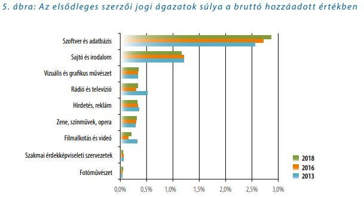

## Dia 14

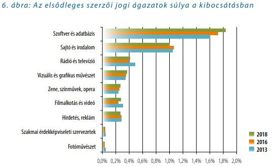

## Dia 15

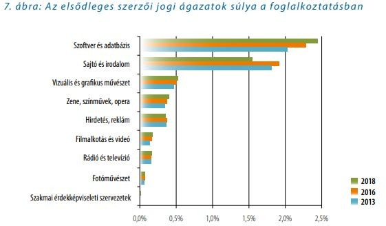

## Dia 16

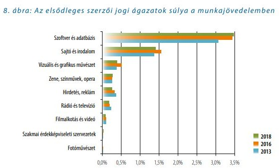

## Dia 17 — A szoftver és az adatbázis jogi védelmének eszköztára (áttekintés)

- A titokvédelem eszközei
  - Szolgálati titok (munkaszerződés, megbízási szerződés keretében)
  - Üzleti titok (elsősorban B2B viszonylatokban)
  - Know-how (minden viszonylatban)
- Szellemi tulajdonjogi védelem
  - Szerzői jogi védelem
  - Iparjogvédelem - szabadalmi oltalom
- Szerződéses konstrukciók
  - Vállalkozási szerződések
  - Üzemeltetési szerződések
  - Felhasználási/Licenciaszerződések
  - Jogátruházó szerződések….és ezek vegyületei

## Dia 18 — II. Szoftverek szerzői jogi védelme

## Dia 19 — II. A szoftver (jogi) fogalma

- John	Tukey	(1958):	elektronikus	adatfeldolgozó	berendezések számítógép) memóriájában elhelyezkedő, azokat működtető program.
- (például
- USA Copyright Act (1980) “utasítások sorozata, mely közvetve vagy közvetlenül számítógépben alkalmazva meghatározott eredmény létrehozását célozza”.
- EU  Szoftver  irányelv  (1991):  “a  védelem  a  számítógépi  programok  bármely formában történő kifejezésére vonatkozik”
- Szjt. (1999) “a számítógépi programalkotás és a hozzá tartozó dokumentáció (a továbbiakban: szoftver) akár forráskódban, akár tárgykódban vagy bármilyen más formában  rögzített  minden  fajtája,  ideértve  a  felhasználói  programot  és  az operációs rendszert is,”

## Dia 20 — A szoftver mint titok védelméről röviden

- 1. § (1) Üzleti titok a gazdasági tevékenységhez kapcsolódó, titkos - egészben, vagy elemeinek összességeként nem közismert vagy az érintett gazdasági tevékenységet végző személyek számára nem könnyen hozzáférhető -, ennélfogva vagyoni értékkel bíró olyan tény, tájékoztatás, egyéb adat és az azokból készült összeállítás, amelynek a titokban tartása érdekében a titok jogosultja az adott helyzetben általában elvárható magatartást tanúsítja.
- (2) Védett ismeret (know-how) az üzleti titoknak minősülő, azonosításra alkalmas módon rögzített, műszaki, gazdasági vagy szervezési ismeret, megoldás, tapasztalat vagy ezek összeállítása. (2018. évi LIV. törvény)
- 8. § (4) A munkavállaló köteles a munkája során tudomására jutott üzleti titkot megőrizni. Ezen túlmenően sem közölhet illetéktelen személlyel olyan adatot, amely munkaköre betöltésével összefüggésben jutott a tudomására, és amelynek közlése a munkáltatóra vagy más személyre hátrányos következménnyel járhat. A titoktartás nem terjed ki a közérdekű adatok nyilvánosságára és a közérdekből nyilvános adatra vonatkozó, törvényben meghatározott adatszolgáltatási és tájékoztatási kötelezettségre. (2012. évi II. törvény)

## Dia 21 — A szoftver szerzői jogilag releváns sajátosságai

- Funkcionális mű (nem esztétikai jelentősége van)
- Felhasználás jellemzően üzleti célú
- Műfelhasználás/műérzékelés összemosódik
- Jellemző a kollektív alkotás
- Speciális a finanszírozás a szerzői művekhez képest (általában megrendelésre)

## Dia 22 — A szoftver, mint szerzői mű

- 1.  §  (1)  Ez  a  törvény  védi  az  irodalmi,  tudományos  és  művészeti alkotásokat.
- (2) Szerzői jogi védelem alá tartozik - függetlenül attól, hogy e törvény megnevezi-e - az irodalom, a tudomány és a művészet minden alkotása. (...)

## Dia 23 — Az egyéni, eredeti jelleg kritériuma

- 1.  §  (3)  A  szerzői  jogi  védelem  az  alkotást  a  szerző  szellemi tevékenységéből  fakadó  egyéni,  eredeti  jellege  alapján  illeti  meg. A védelem nem függ mennyiségi, minőségi, esztétikai jellemzőktől vagy az alkotás színvonalára vonatkozó értékítélettől.
- Nem amiatt áll oltalom alatt, mert jól oldja meg a feladatot, hanem mert sajátosan  (akkor  is  állhat  védelem  alatt,  ha  rosszul  oldja  meg,  - jelentősége van a hibás teljesítésnél, esetleg mással való kijavíttatásnál)!

## Dia 24 — Egyéni, eredeti jelleg a funkcionális alkotásokban

- “Az  alkotás  terének  nagysága,  ezáltal  az  egyéni,  eredeti  jelleg  megállapítása műtípusonként eltérő kritériumrendszer mentén történik: a kifejezés védelme igazodik a tartalom és a műfajta sajátosságaihoz. … A funkció és a kötöttségek nagymértékben szűkítik az egyéni eredeti jelleg kifejezhetőségének terét.”
- “Ha az egyes tervezők a funkcionális elvárások figyelembevételével is egymástól eltérő eredményre juthatnak, a terv egyéni-eredeti jellegűnek minősül.”
- “Nem állhatnak szerzői jogi védelem alatt senki javára azok a teljesítmények, amelyek mindenki számára szabadon hozzáférhetők, a különböző szakmai, technikai előírások, elvárások, általános kritériumoknak megfelelő alkotóelemek, sablonok.”
- SZJSZT-34/2000 - Szabványok szerzői jogi védelme, SZJSZT-23/2010 - Konstrukciós tervek, gyártmánytervek és látványtervek szerzői jogi megítélése

## Dia 25

- EUB C-406/10. SAS Institute Inc kontra World Programming Ltd.
- “Sem  a  számítógépi  program  funkcionalitása,  sem  a  számítógépi  program keretében  a  program  bizonyos  funkcióinak  a  használata  céljából  alkalmazott programnyelv és adatfájl formátum nem minősül e program kifejezési formájának és ekként nem részesül szerzői jogi védelemben.”
- EUB C-406/10., BH 1993. 545.
- Dokumentáció védett akkor is, ha a szoftver nem áll rendelkezésre (nincs 	készen, v. csak részleteiben)
- “...az előbbinek a megalkotása szükségképpen az utóbbinak a létrehozására 	irányul, de tényleges létrejötte nem előfeltétele a dokumentáció önálló szerzői 	jogi védelmének...”

## Dia 26 — A szoftver átírása más programnyelvre

- Szjt. 58. § (2) A 4. § (2) bekezdésében foglaltakat alkalmazni kell a szoftvernek az eredeti programnyelvétől eltérő programnyelvre történő átírására is.
- 4. § (2) Szerzői jogi védelem alatt áll - az eredeti mű szerzőjét megillető jogok sérelme nélkül
- más szerző művének átdolgozása, feldolgozása vagy fordítása is, ha annak egyéni, eredeti jellege van.

## Dia 27 — Interface nem védett, mint mű

- 1. § (6) Valamely ötlet, elv, elgondolás, eljárás, működési módszer vagy matematikai művelet nem lehet tárgya a szerzői jogi védelemnek.
- 58. § (1) Az 1. § (6) bekezdésében foglalt rendelkezést alkalmazni kell a szoftver csatlakozó felületének alapját képező ötletre, elvre, elgondolásra, eljárásra, működési módszerre vagy matematikai műveletre is.
- T-201/04. Microsoft v. Sun Az interoperabilitásra vonatkozó információk közlésének és ezen információk felhasználása engedélyezésének az  erőfölényben lévő vállalkozás általi megtagadása sérti a versenyjogi szabályokat.

## Dia 28 — Nem szoftverként védett, kapcsolódó művek

- Grafikus felület C-393/09. Bezpečnostní softwarová asociace - Svaz softwarové ochrany kontra Ministerstvo kultury.
- “Valamely  számítógépi  program  grafikus  felhasználói  felülete  nem  minősül  a  program bármely formában történő kifejezésének és nem részesülhet a számítógépi programok szerzői jogi védelmében. Azonban e felület szerzői jogi védelemben részesülhet, ha ez a felület a szerző saját szellemi alkotásának minősül.”
- Honlap SZJSZT-08/2012 - Turisztikai honlap védelme Adatbázis SZJSZT-12/2010 (szótár), SZJSZT-19/2009 (jogtár) Betűfontok SZJSZT 20/2004., 38/2004. Fontok védelme

## Dia 29

- Védett elemek:
- - forráskód- tárgykód- dokumentáció (specifikáció, felhasználási útmutató)
- - kapcsolódó adatbázisok
- NEM védett elemek:
- - programozási nyelv
- adatformátum
- koncepció
- funkcionalitás
- grafikus felhasználói felület (DE: grafikai mű szerzői jogi oltalma vagy design oltalom)

## Dia 30 — A szoftverfejlesztő, mint szerző

- Szoftver Irányelv 2. cikk: természetes személy, azok csoportja, jogosultnak minősülő jogi személy (ha tagállam azt megengedi)
- Szjt.: csak természetes személy
- De az általános rendelkezésektől eltér:
- 58. (3) A szoftverre vonatkozó vagyoni jogok átruházhatók. – piaci igények, pl. egyedileg megrendelt szoftver
- 30. § (1) Eltérő megállapodás hiányában a mű átadásával a vagyoni jogokat a szerző jogutódjaként a munkáltató szerzi meg, ha a mű elkészítése a szerző munkaviszonyból folyó kötelessége.

## Dia 31 — A	szoftveren keletkező engedélyezési (vagyoni) jogok

- Általános szabályok: többszörözés, terjesztés, bérbeadás, átdolgozás
- De! speciális kivételek – a szoftver felhasználójának érdekeit szolgálják Kivételek 2 csoportja:
- szerződésben kizárható kivételek
- szerződésben ki nem zárható kivételek

## Dia 32 — A szoftver többszörözése, mint vagyoni jog

- A számítógépi program bármely eszközzel és bármely formában, részben vagy egészben  történő  tartós  vagy  időleges  többszörözése.  Amennyiben  a számítógépi  program  betáplálása,  megjelenítése,  futtatása,  továbbítása  vagy tárolása  szükségessé  teszi  az  ilyen  többszörözést,  az  ilyen  cselekményhez szükséges a jogosult engedélye;
- BH 2002.616 A számítógépi programnak a szabad felhasználás joga nélkül való megszerzése mástól másolás céljára, a szerzői vagy szerzői joghoz kapcsolódó jogok megsértését valósítja meg.
- BH 2009.232 A nem ingyenes - a nem szabad felhasználás körébe tartozó - programnak az interneten elérhető ún. “Kalózszerverek”-ről - emelt díjas SMS-ek fejében - történő letöltése nem tekinthető jogszerű felhasználásnak, hanem olyan többszörözés, ami a jogtulajdonosnak hátrányt okozva a szerzői jogok megsértése bűncselekményét valósítja meg.

## Dia 33 — A szoftver átdolgozása, terjesztése, mint vagyoni jog

- A számítógépi program lefordítása, átdolgozása, feldolgozása és bármely más módon  történő  módosítása  -  ideértve  az  eredeti  programnyelvről  más programnyelvre történő átírást;
- A számítógépi program vagy másolatai bármilyen formában történő nyilvános terjesztése,  beleértve  a  bérbeadást  is. A program  valamely  példányának  a jogosult által vagy az ő hozzájárulásával a Közösségen belül történő első eladása kimeríti  az  adott  példány  Közösségen  belüli  terjesztésére  vonatkozó  jogot,  a számítógépi   program   vagy   valamely   másolata   további   bérbeadásának ellenőrzéséhez való jog kivételével.

## Dia 34 — Kizárható (szerződhető) kivétel az engedélyezési jog alól

- Szjt. 59. § (1): Eltérő megállapodás hiányában a szerző kizárólagos joga nem	terjed	ki	a	többszörözésre,	az	átdolgozásra,	a	feldolgozásra,	a
- fordításra,  a  szoftver  bármely  más  módosítására  -  ideértve  a  hiba kijavítását is -, valamint ezek eredményének többszörözésére annyiban, amennyiben  e  felhasználási  cselekményeket  a  szoftvert  jogszerűen megszerző személy a szoftver rendeltetésével összhangban végzi.
- Ok: használat közben felmerülő hibák, rendellenességek kijavítása
- De: feltételhez  kötött  és  szerződésben  ki  lehet  zárni  (ld.  üzemeltetési szerződések)!

## Dia 35 — Nem kizárható kivételek az engedélyezési jog alól - biztonsági másolat

- 59. § (2) A felhasználási szerződésben sem zárható ki, hogy a felhasználó egy biztonsági  másolatot  készíthessen  a  szoftverről,  ha  az  a  felhasználáshoz szükséges. (Ld. BH fent, C-166/15.)
- “...bár a számítógépi program korlátlan használati engedéllyel ellátott példányának eredeti megszerzője jogosult e példányt és engedélyét egy későbbi vásárlónak eladni, az említett program biztonsági másolatát a jogosult engedélye nélkül e későbbi vásárlónak nem adhatja át, ha a példánynak a részére először átadott eredeti fizikai adathordozója megsérült, megsemmisült vagy elveszett.”

## Dia 36 — Nem kizárható kivételek az engedélyezés alól - tanulmányozás

- 59. § (3) Aki a szoftver valamely példányának felhasználására jogosult, a szerző engedélye nélkül is megfigyelheti és tanulmányozhatja	a szoftver működését, továbbá kipróbálhatja a szoftvert annak betáplálása, képernyőn való megjelenítése, futtatása,	 továbbítása vagy tárolása (i.e. többszörözése)	során abból a célból, hogy a szoftver valamely elemének alapjául szolgáló elgondolást vagy elvet megismerje.

## Dia 37 — Nem kizárható kivételek az engedélyezési jog alól - dekompiláció az összekapcsolhatóság érdekében

- 60. § (1) A szerző engedélye nem szükséges a kód olyan többszörözéséhez vagy fordításához, amely  elengedhetetlen az önállóan megalkotott szoftvernek más szoftverekkel való együttes működtetéséhez szükséges információ megszerzése érdekében, feltéve, hogy
- a)	e	felhasználási	cselekményeket	a	jogszerű	felhasználó	vagy	a	szoftver
- példányának felhasználására jogosult más személy, vagy az ő megbízottjuk végzi;
- b)	az	együttes	működtetéshez	szükséges	információ	az	a)	pontban	említett személyek számára nem vált könnyen hozzáférhetővé;
- c) e felhasználási cselekmények a szoftvernek azokra a részeire korlátozódnak, amelyek az együttes működtetés biztosításához szükségesek.
- Minden más esetben a visszafejtés engedélyhez kötött!

## Dia 38 — ... és a személyhez fűződő jogok

- Névfeltüntetés joga
- Nyilvánosságra hozatal
- Visszavonás joga
- Integritásvédelem

## Dia 39 — Munkaviszonyban alkotott szoftverek

- Eltérő megállapodás hiányában a mű átadásával a vagyoni jogokat a szerző jogutódjaként a munkáltató szerzi meg, ha a mű elkészítése a szerző munkaviszonyból folyó kötelessége.
- A megszerzett vagyoni jogok a munkáltató személyében bekövetkezett jogutódlás esetén átszállnak a munkáltató jogutódjára.
- A szerzőt megfelelő díjazás illeti meg, ha a munkáltató a felhasználásra másnak engedélyt ad vagy a művel kapcsolatos vagyoni jogokat másra átruházza.

## Dia 40 — III. Az adatbázisok szerzői jogi védelme

## Dia 41 — A jog mai állapota historikus fejlődés eredménye…

- Adatbázisvédelem level1: védett a gyűjteményes mű, ha egyébként művekből áll
- Adatbázisvédelem level2: védett a gyűjteményes mű, amely az adatok (nem védett művek) gyűjteménye
- Adatbázisvédelem level3: nemcsak a szerző, hanem az előállító is védett

## Dia 42 — Magyar szerzői jogi védelem level1.

- Gyűjteményes mű: a gyűjtemény, ha tartalmának összeválogatása, elrendezése vagy szerkesztése egyéni, eredeti jellegű. A védelem a gyűjteményes művet megilleti akkor is, ha annak részei, tartalmi elemei nem részesülnek, illetve nem részesülhetnek szerzői jogi védelemben.
- szerzői	jog	a	szerkesztőt illeti, ez	azonban 	nem érinti a gyűjteménybe felvett egyes művek szerzőinek és szomszédos jogi teljesítmények jogosultjainak önálló jogait
- szerzői jogi védelme nem terjed ki a gyűjteményes mű tartalmi elemeire.
- Pl. tanulmánykötet, verseskötet, kottagyűjtemény

## Dia 43

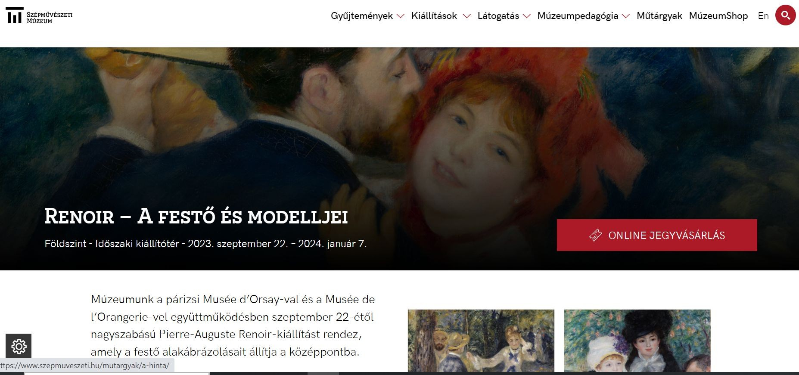

## Dia 44

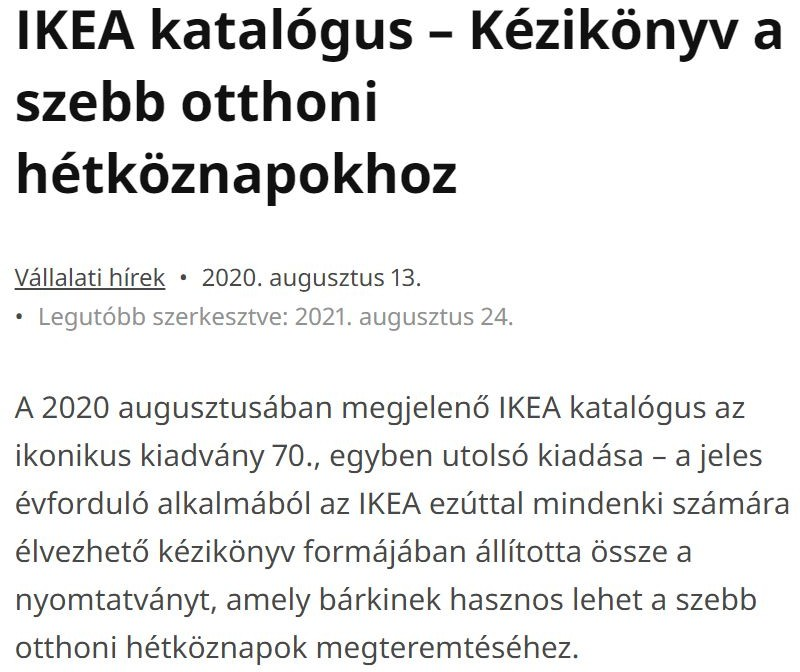

## Dia 45 — Szerzői jogi védelem level2/1.

- Adatbázis: önálló művek, adatok vagy egyéb tartalmi elemek valamely rendszer  vagy  módszer  szerint  elrendezett  gyűjteménye,  amelynek tartalmi elemeihez - számítástechnikai eszközökkel vagy bármely más módon - egyedileg hozzá lehet férni. + dokumentáció/- szoftver
- Gyűjteményes mű + adatbázis = gyűjteményes műnek minősülő adatbázis
- - szerzői jogi védelemben csak a gyűjteményes műnek minősülő adatbázis részesül! (A nem szerzői mű adatbázis is védelem alatt fog állni, csak nem szerzői jogi védelem alatt – üzleti titok, adatvédelem stb.)

## Dia 46

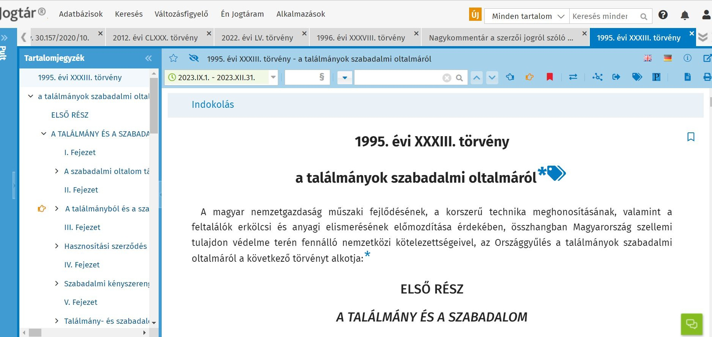

## Dia 47

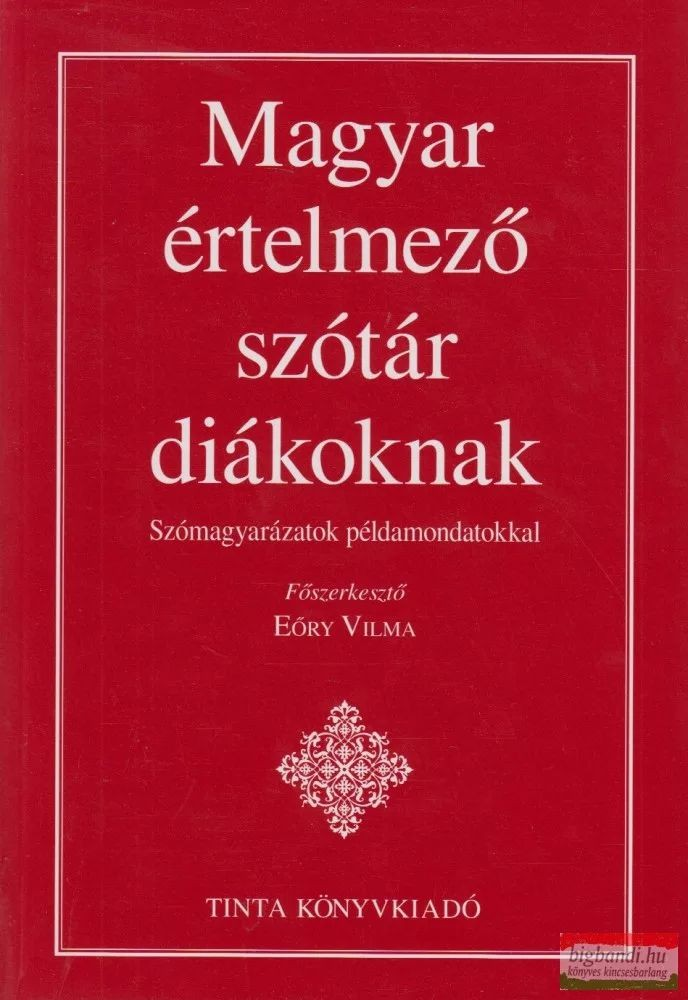

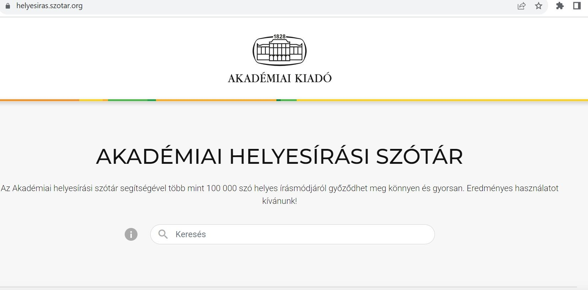

## Dia 48 — Szerzői jogi védelem level 2/2.

- Gyűjteményes mű (adatbázis nélkül)
- Vagyoni jogok nem átruházhatók
- Írásbeli szerződést kell kötni a felhasználására
- Egyes cselekmények nem 	védettek a szerzői jog által:
- olvasás, lapozás, böngészés.
- Gyűjteményes műnek minősülő adatbázis
- Vagyoni jogok átruházhatók (forgalomképesség!)
- ÚJ (2021) SZABÁLY: Nem kötelező a szerződés írásba foglalása
- Nem szükséges a szerző engedélye ahhoz, hogy az adatbázist jogszerűen felhasználó személy  az  adatbázis  tartalmához  való hozzáféréshez és az adatbázis tartalmának rendeltetésszerű felhasználásához szükséges cselekményeket elvégezze.

## Dia 49 — Magyar szerzői jogi védelem level3.

- […]	az	adatbázis-előállítók	teljesítményei	az	e	törvényben	meghatározott védelemben részesülnek – nem szerzői, hanem kapcsolódó jog/sui generis védelem
- •
- Azon	adatbázisok	előállítói
- számára,
- amelyek
- tartalmának
- megszerzése,
- ellenőrzése	illetve	előállítása	minőségileg	vagy	mennyiségileg	jelentős
- ráfordítással járt.
- Adatbázis előállító sui generis jogosultsága alapja: ha az adatbázis tartalmának megszerzése, ellenőrzése vagy megjelenítése jelentős ráfordítást igényelt.
- Jogosult: természetes személy, jogi személy vagy jogi személyiséggel nem rendelkező gazdasági társaság, aki vagy amely saját nevében és kockázatára kezdeményezte az adatbázis előállítását, gondoskodva az ehhez szükséges ráfordításokról.

## Dia 50 — Magyar szerzői jogi védelem level 3/2.

- Sui generis jogok (engedélyezés):
- Kimásolás: másolat készítése útján többszörözzék
- Újrahasznosítás: a nyilvánosság számára hozzáférhetővé tétel az adatbázis példányainak terjesztésével vagy nyilvánossághoz való közvetítéssel (jogkimerülés általános szabályai)
- Az adatbázis előállítójának hozzájárulása nélkül ismételten és rendszeresen nem másolható ki, illetve nem hasznosítható újra az adatbázis tartalmának jelentéktelen része sem, ha ez sérelmes az adatbázis rendes felhasználására, vagy indokolatlanul károsítja az adatbázis előállítójának jogos érdekeit.

## Dia 51 — Magyar szerzői jogi védelem

- level3/3.
- Védelmi idő: 1. nyilvánosságra hozatalt vagy az elkészítést követő év első napjától számított 15 év (többi szint: általános védelmi idő!)
- DE: újra kezdődik, ha az adatbázis tartalmát jelentősen megváltoztatják úgy, hogy annak eredményeként a megváltoztatott adatbázis önállóan is jelentős ráfordítással előállítottnak számít. Az adatbázis tartalmának jelentős megváltoztatása eredhet az egymást követő bővítések, elhagyások és módosítások halmozódásából is.

## Dia 52

- Nem szükséges az adatbázis előállítójának hozzájárulása ahhoz, hogy a nyilvánosságra hozott adatbázist jogszerűen felhasználó személy az adatbázis tartalmának jelentéktelen részét - akár ismételten és rendszeresen is - kimásolja, illetve újrahasznosítsa.
- Magáncélra bárki  kimásolhatja  az adatbázis  tartalmának  jelentős  részét  is,  ha  az  jövedelemszerzés vagy jövedelemfokozás célját közvetve sem szolgálja. E rendelkezés nem vonatkozik a számítástechnikai eszközökkel működtetett adatbázisra.
- A forrás megjelölésével iskolai oktatás vagy tudományos kutatás céljára - a célnak megfelelő módon és mértékig - az adatbázis tartalmának jelentős része is kimásolható, ha az jövedelemszerzés vagy jövedelemfokozás célját közvetve sem szolgálja.
- Bírósági, továbbá államigazgatási vagy más hatósági eljárásban bizonyítás céljára az adatbázis tartalmának jelentős része is kimásolható vagy újrahasznosítható, a célnak megfelelő módon és mértékig.
- Az adatbázis nem üzletszerű célra szabadon kimásolható vagy újrahasznosítható, ha a kimásolás vagy újrahasznosítás kizárólag fogyatékossággal élő személyek javára, fogyatékosságukkal közvetlen összefüggésben történik, és az nem haladja meg a fogyatékosság által indokolt mértéket.

## Dia 53 — KÖSZÖNÖM A FIGYELMET!

- TOMASOVSZKY.EDIT@GTK.BME.HU
