# 07-e-kereskedelem

## Dia 1

- Dr. Bárány Viktória Fanny barany.viktoria.fanny@gtk.bme.hu
- BME Gazdaság- és Társadalomtudományi KarÜzleti Jog Tanszék
- Elektronikus kereskedelem DSA

## Dia 2

| https://docs.google.com/forms/d/e/1FAIpQLSfGWUJnctO48_fP5FHRw779wRaiBduF1Yit3TNdUusGB5fVjA/viewform?usp=publish-editor |
| --- |

## Dia 3

- Forrás: https://www.pwc.com/hu/hu/sajtoszoba/assets/pwc-dkk-2025-II.pdf

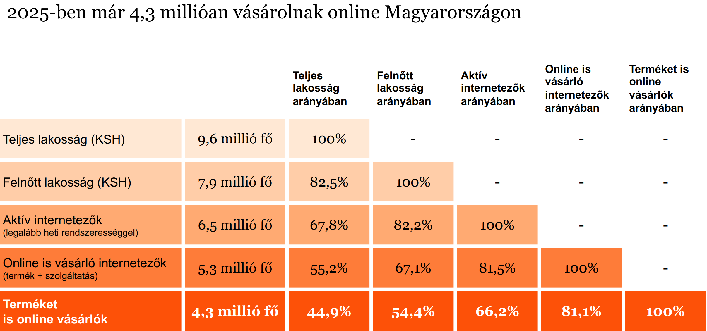

## Dia 4

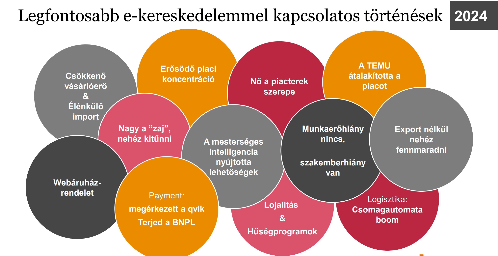

- Forrás: https://www.pwc.com/hu/hu/sajtoszoba/assets/pwc-dksz_dkk-2024.pdf

**Előadói jegyzet:**
> Buy now pay later (áruhitelek digitális alternatívája)
> A vásárlás során a vevő nem azonnal fizet a termékekért és szolgáltatásokért, hanem a fizetést több (jellemzően 3-4) részletre osztja és azokat meghatározott időközönként (jellemzően havonta) teljesíti.

## Dia 5

- Forrás: https://www.pwc.com/hu/hu/sajtoszoba/assets/pwc-dkk-2025-II.pdf

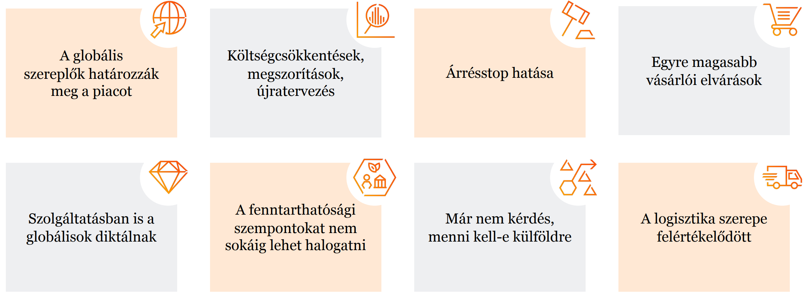

- Az e-kereskedelem alakulását meghatározó legfontosabb tényezők 2025-ben

**Előadói jegyzet:**
> Buy now pay later (áruhitelek digitális alternatívája)
> A vásárlás során a vevő nem azonnal fizet a termékekért és szolgáltatásokért, hanem a fizetést több (jellemzően 3-4) részletre osztja és azokat meghatározott időközönként (jellemzően havonta) teljesíti.

## Dia 6

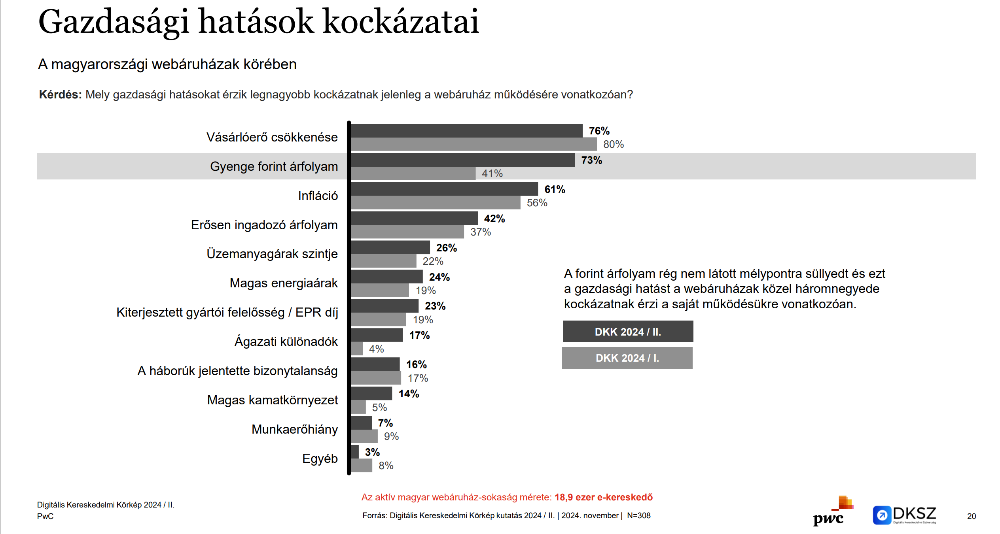

- Forrás: https://www.pwc.com/hu/hu/sajtoszoba/assets/pwc-dksz_dkk-2024.pdf

## Dia 7

- E-gazdaság
- A hagyományos vállalati funkciók, tevékenységek, termékek elektronikus útra terelése. Tág értelmű gyűjtőfogalom, mely bár az internet megjelenését és elterjedését követően került az elemzések középpontjába, alapjait a számítógép megjelenése és alkalmazása jelentette.
- E-kereskedelem
- Termékek (áruk) és szolgáltatások számítógépes hálózatok és infokommunikációs eszközök igénybevételével történő értékesítése.
- a webáruház vagy egyéb tranzakciós platform kialakítása és működtetése, a készletezés és a logisztika, a hirdetés és marketingtevékenység, a fizetési tranzakció
- Elég, ha a teljes vásárlási folyamat egy része zajlik az internet segítségével
- Részét képezi:

## Dia 8

- A2B
- Államigazgatástól üzleti szereplőknek Pl.: Cégkapu
- B2A
- Üzleti szereplőktől az államigazgatásnak Pl.: közbeszerzés
- B2B
- Üzleti szereplőktől üzleti szereplőknek Pl.: elektronikus számlázás
- C2C
- Fogyasztóktól fogyasztóknak. Pl.: Etsy, Ebay
- B2C
- Üzleti szereplőktől fogyasztóknak. Pl.: webshop
- E-gazdaság és e-kereskedelem típusai
- C2B
- Dropshopping
- Subscription Model
- D2C
- Direkt to consumer. E-ker vállalat maga irányítja termelést, csomagolást, forgalmazást, szállítást.
- Fogyasztó (egyén) adja el a szolgáltatását az üzleti szereplőnek. Pl.: influenszer marketing
- Üzleti szereplő olyan terméket értékesít, amelyeket egy másik üzleti szereplő gyárt, csomagol, raktároz és akár szállít is. Pl.: Alza.hu
- Előfizetésen alapuló e-kereskedelmi modell. Az üzleti szereplő arra vállal kötelezettséget, hogy a fogyasztót termékkel, szolgáltatással látja el folyamatosan. Pl.: Netflix, Spotify

## Dia 9

- Miért szervező elv az e-kereskedelem?
- A digitális gazdaságban az e-kereskedelem teljes folyamatot szervez: nem csatorna, hanem struktúra.
- Reklám
- Keresés
- Kosár
- Fizetés
- Teljesítés
- Jogérvényesítés
- Az elektronikus közeg a klasszikus elemeket – ajánlat, elfogadás, tájékoztatás, fizetés, teljesítés – új technikai környezetbe helyezi.
- A folyamat automatizált, algoritmizált és gyakran platformközvetített; emiatt a technikai infrastruktúra és a felületi design is jogi jelentőséget kap.
- A határon átnyúló működés miatt a belső piaci és nemzetközi magánjogi kérdések is kiemelkedő jelentőséggel bírnak
- Az online kereskedelem a klasszikus kötelmi jogra épül; ezt nem váltja fel, hanem digitális közegre fordítja át.
- 5

## Dia 10

- Az elektronikus kereskedelem és a klasszikus magánjog
- Változatlan alapok
- Mi változik az online térben?
- A szerződés továbbra is egybehangzó akaratnyilatkozatokkal jön létre.
- Az ajánlat és elfogadás logikája online térben is irányadó.
- Az adásvétel lényege változatlan: az eladó átruház, a vevő vételárat fizet.
- Az ÁSZF offline és online is tömeges szerződési technika.
- Az ajánlat és elfogadás gombnyomássá, felületi lépéssé válik.
- Az írásbeliség elektronikus dokumentummá és bizalmi szolgáltatássá alakul.
- A tájékoztatás egyben interface-kérdés lesz.
- A felelősség többszereplős platformarchitektúrában oszlik meg.
- Kulcstétel: az online kereskedelem nem „új magánjog”.
- 7
- A „Megrendelem” gomb nem pusztán technikai utasítás lehet, hanem olyan jognyilatkozat, amely fizetési kötelezettséget keletkeztet. A Fuhrmann–2 ügyben az Európai Unió Bírósága kimondta: ha a gombfelirat nem egyértelmű, a fogyasztó nem kötődik a szerződéshez.

## Dia 11

- Az elektronikus kereskedelem szabályozási kerete
- Magyar és uniós szabályozás - alapnormák és kapcsolódó jogforrások
- Magyar szabályozás
- EU szabályozás
- Alapnormák
- 2001. évi
- CVIII. tv.
- az elektronikus kereskedelmi szolgáltatásokról és az információs társadalommal összefüggő szolgáltatások egyes kérdéseiről Ekertv.
- 2013. évi
- V. tv.
- a Polgári Törvénykönyvről - az általános szerződési, kötelmi és fogyasztói szerződési háttér Ptk.
- 1997. évi
- CLV. tv.
- a fogyasztóvédelemről - intézményi és jogérvényesítési háttér Fgytv.
- 2008. évi
- XLVII. tv.
- a fogyasztókkal szembeni tisztességtelen kereskedelmi gyakorlat tilalmáról Fttv.
- 45/2014. (II.26.)
- Korm. rend.
- a fogyasztó és a vállalkozás közötti szerződések részletes szabályairól
- 373/2021. (VI.30.)
- Korm. rend.
- az áruk adásvételére, valamint a digitális tartalom és digitális szolgáltatások nyújtására irányuló B2C szerződések részletes szabályairól
- Magyar fókusz az e-kereskedelmi tananyagban
- Ekertv. - fogalmak, hatály, szolgáltatói adatszolgáltatás, elektronikus szerződéskötés, közvetítői felelősség, értesítési-eltávolítási eljárás. Ptk. és fogyasztóvédelmi normák - szerződési és teljesítési háttér.
- Alapnormák és digitális piacszabályozás
- 2000/31/EK irányelv
- az információs társadalommal összefüggő szolgáltatások, különösen az elektronikus kereskedelem egyes jogi vonatkozásairól E-Commerce Directive
- (EU)
- 2022/2065
- a digitális szolgáltatások egységes piacáról és a 2000/31/EK irányelv módosításáról DSA
- (EU)
- 2022/1925
- a digitális ágazat vonatkozásában a versengő és tisztességes piacokról DMA
- Kapcsolódó uniós keret
- (EU)
- 910/2014
- eIDAS - elektronikus azonosítás és bizalmi szolgáltatások
- (EU)
- 2015/2366
- PSD2 - elektronikus fizetési infrastruktúra és erős ügyfél-hitelesítés
- 593/2008/EK
- Róma I. rendelet - a szerződésre alkalmazandó jog
- 1215/2012/EU
- Brüsszel Ia. rendelet - joghatóság és határozatok elismerése
- (EU)
- 2023/2854
- Data Act - tisztességes adathozzáférés és adatfelhasználás
- Logikai üzenet: az e-kereskedelem szabályozása többszintű; az Ekertv. a hazai alaptörzs, amelyre Ptk.-, fogyasztóvédelmi, digitális szolgáltatási és uniós belső piaci normák épülnek.

## Dia 12

- Miért van szükség az elektronikus kereskedelem szabályozására?
- Az e-kereskedelem szabályozási szintjei
- „A fogyasztónak igen előnyös lesz a hálózati életmód. A Web, a világ leghatalmasabb bevásárlóközpontja, olyan kínálatot nyújt majd a vásárlóknak, amilyennel azelőtt nem találkozhattak. Megtalálják a keresett termék összes változatát, és sok esetben személyre is szabhatják a szolgáltatásokat. A végterméket pedig házhoz szállítják.”
- Bill Gates, 1999.

| Jogi szabályozás | stabil keretek, jogi kötőerő változásokhoz való folyamatos adaptálás, egyre részletesebb és szigorúbb szabályozás |
| --- | --- |
| Önszabályozás | alternatív szabályozási mechanizmus szakmai önszabályozás – kódex, iránymutatások kiegészíti a jogi szabályozást, általában annál kidolgozottabb, részletesebb pl. Magyar Reklámetikai Kódex |
| Belső szabályozás | saját belső szabályzatok, irányelvek kiegészíti, vagy akár meg is haladja a jogi szabályozást platform saját működésére, a szolgáltatásokat igénybe vevő felhasználók magatartására, tevékenységére vonatkozó szabályok, tilalmak pl. Meta közösségi alapelvei |

## Dia 13

- DSA

## Dia 14

- DSA és DMA rendeletek
- Az online közvetítőket és piactereket szabályozza (piacterek, közösségi hálózatok, tartalommegosztó platformok, alkalmazás áruházak, online utazási és szállásplatformok)

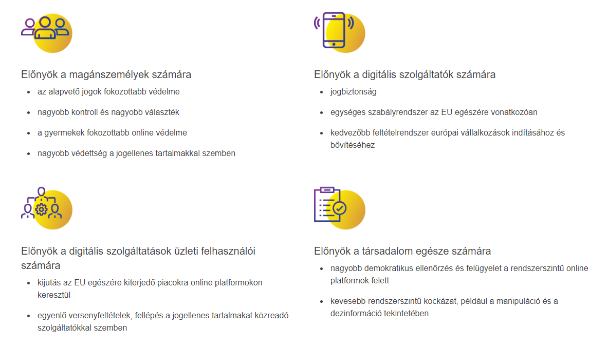

- Cél: biztonságosabb digitális tér létrehozása, amelyben a digitális szolgáltatások valamennyi felhasználójának alapvető jogai védelemben részesülnek

## Dia 15

- DSA és DMA rendeletek

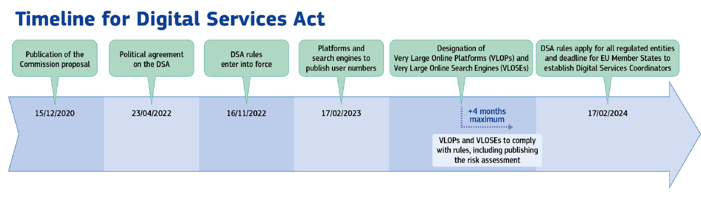

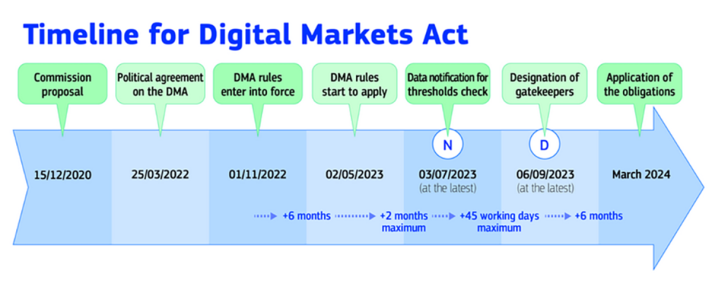

## Dia 16

- A DSA rendelet területi hatálya
- Elhelyezkedésüktől függetlenül azokra a szolgáltatókra terjed ki, melyek az Unióban tartózkodó igénybe vevők részére kínálnak szolgáltatásokat, függetlenül attól, hogy az EU-ban vagy azon kívül székhellyel rendelkeznek-e.

## Dia 17

- A DSA rendelet tárgyi hatálya
- az EU 450 millió fogyasztójának több mint 10%-át elérő online óriásplatformok és nagyon népszerű online keresőprogramok (VLOP, VLOSE): kiemelt kockázatot jelentenek a jogellenes tartalmak terjesztése és társadalmi károkozás tekintetében. az eladókat és fogyasztókat összefogó online platformok: online piacterek, alkalmazásáruházak, közösségi gazdasági platformok és közösségimédia-platformok.
- Tárhelyszolgáltatások: felhőalapú számítástechnikai és webhosting szolgáltatások. közvetítő szolgáltatások: internet-hozzáférési szolgáltatást nyújtó szolgáltatók, doménnév-regisztrátorok

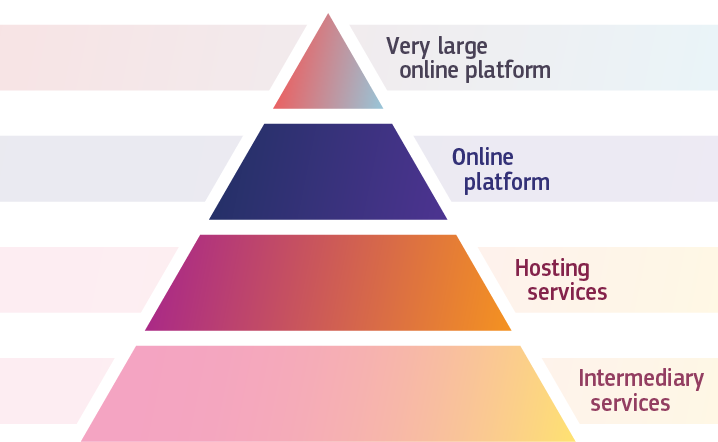

- Kép forrása: https://commission.europa.eu/strategy-and-policy/priorities-2019-2024/europe-fit-digital-age/digital-services-act_hu

## Dia 18

- A DSA hatálya és kategóriái
- A DSA horizontális és aszimmetrikus: mindenkire vonatkozik, de a nagyobb platformokra több kötelezettséget telepít.
- Közvetítő szolgáltató
- Minimális közös kötelezettségek
- Tárhelyszolgáltató
- Notice-and-action és döntésindokolás
- Online platform
- Belső panaszkezelés, trusted flagger, piactéri átvilágítás
- Online óriásplatform / VLOP
- Kockázatkezelés, audit, ajánlórendszer-átláthatóság, adathozzáférés
- Fontos küszöb: az online óriásplatformok havonta átlagosan legalább 45 millió aktív uniós felhasználót érnek el. A DSA 2024. február 17-től teljes körűen alkalmazandó.
- Vizsgán tudni kell: horizontális + aszimmetrikus szabályozás.
- 16

## Dia 19

- A közvetítő szolgáltatók közös kötelezettségei
- Információszolgáltatás hatósági határozat alapján: jogellenes tartalom elleni fellépéshez kapcsolódó határozat okán azonnali értesítési kötelezettség a hatóság felé a végrehajtott intézkedésről; vagy konkrét információ nyújtás
- Kapcsolattartó pontok és jogi képviselők kijelölése: kapcsolattartó pont, amely lehetővé teszi a hatóságokkal folytatott közvetlen elektronikus kommunikációt. Azok a szolgáltatók amelyek nem rendelkeznek székhellyel az Unióban, de ott szolgáltatásokat kínálnak, ki kell jelölniük jogi képviselőnek egy természetes vagy jogi személyt az egyik olyan tagállamban, ahol a szolgáltatásaikat kínálják
- Tájékoztatás a korlátozásokról a szerződéses feltételekben: a szolgáltatás igénybe vevője által megadott információkra vonatkozóan a szolgáltatásaik használatával kapcsolatban bevezetett korlátozásokról (például a tartalommoderálás, algoritmikus döntéshozatal, emberi felülvizsgálat szabályai). Kiskorúak esetén számukra érthető módon.
- Éves átláthatósági jelentés közzététele: szolgáltatók legalább évente egyszer egyértelmű, könnyen érthető és részletes jelentést tesznek közzé az adott időszakban végzett tartalommoderálásról

## Dia 20

  - Az online platformokra vonatkozó további rendelkezések
- Bűncselekmények gyanújának bejelentése: bármely olyan információ, amelynek alapján felmerül a súlyos, emberek életét vagy biztonságát fenyegető bűncselekmény elkövetésének vagy valószínűsíthető elkövetésének gyanúja, a szolgáltató haladéktalanul tájékoztatja az érintett tagállamok bűnüldözési vagy igazságügyi hatóságait, bizonyos esetekben pedig az Europolt a gyanújáról, és rendelkezésükre bocsát valamennyi elérhető releváns információt.
- Belső panaszkezelési rendszer, peren kívüli vitarendezés: felhasználóbarát, könnyen hozzáférhető belső elektronikus panaszkezelési rendszer. Az illegális tartalmakkal kapcsolatos döntése által érintett felhasználók jogosultak peren kívüli vitarendezési testülethez fordulni. Az online platformokat köti a testület döntése.
- Megbízható bejelentők kiemelt kezelése: A megbízható bejelentő státuszt a digitális szolgáltatási koordinátor ítéli oda a DSA feltételei alapján. A megbízható bejelentők listáját a Bizottság nyilvánosan elérhető adatbázisban közzéteszi.

## Dia 21

  - Az online platformokra vonatkozó további rendelkezések
- Visszaélésekkel szembeni intézkedések és védelem: a szolgáltatás nyújtásának felfüggesztése az olyan igénybe vevője számára, amely gyakran bocsát rendelkezésre nyilvánvalóan jogellenes tartalmat. Az online platformok továbbá felfüggesztik az olyan személyek által tett bejelentések és panaszok feldolgozását, akik gyakran tesznek nyilvánvalóan megalapozatlan bejelentéseket vagy panaszokat.
- Üzleti partnerek átvilágítása: azonosítaniuk kell az EU-beli felhasználóiknak üzenetet küldő vagy termékeket, szolgáltatásokat kínáló kereskedőiket, és be kell szerezniük róluk a DSA-ban felsorolt információkat. Ha az online platform szolgáltató tudomást szerez arról, hogy egy kereskedő rajta keresztül jogellenes terméket vagy szolgáltatást kínált, tájékoztatnia kell a fogyasztókat a termék vagy szolgáltatás jogelleneségéről, a kereskedőt azonosító adatokról és a jogorvoslatról.
- Részletesebb átláthatósági jelentések
- Könnyen hozzáférhető, világos és egyértelmű összefoglaló az ÁSZF-ről (VLOP & VLOSE)
- + táblázat!

## Dia 22

|  | Közvetítői szolgáltatások (halmozott kötelezettségek) | Tárhelyszolgáltatások (halmozott kötelezettségek) | Online platformok (halmozott kötelezettségek) | Óriásplatformok (halmozott kötelezettségek) |
| --- | --- | --- | --- | --- |
| Átláthatósági jelentéstétel | ● | ● | ● | ● |
| Az alapvető jogok megfelelő figyelembevételén alapuló szolgáltatási feltételek | ● | ● | ● | ● |
| Együttműködés tagállami hatóságokkal végzések/határozatok alapján | ● | ● | ● | ● |
| Kapcsolattartási pontok és szükség esetén jogi képviselő | ● | ● | ● | ● |
| Bejelentési-cselekvési mechanizmus, a felhasználók tájékoztatására irányuló kötelezettség |  | ● | ● | ● |
| Bűncselekmények bejelentése |  | ● | ● | ● |
| Panaszkezelési és jogorvoslati mechanizmus, alternatív vitarendezés |  |  | ● | ● |
| Megbízható bejelentők |  |  | ● | ● |
| Visszaélésszerű bejelentések és viszontbejelentések elleni intézkedések |  |  | ● | ● |
| Speciális kötelezettségek a piacterek számára, pl. harmadik fél szolgáltatók átvilágítása („Ismerd az üzleti ügyfeledet”), megfelelést biztosító kialakítás, véletlenszerű ellenőrzések |  |  | ● | ● |
| A gyermekeknek szóló és a felhasználók sajátos jellemzőin alapuló célzott hirdetések tilalma |  |  | ● | ● |
| Az ajánlórendszerek átláthatósága |  |  | ● | ● |
| Az online hirdetések átláthatóságának biztosítása a felhasználók számára |  |  | ● | ● |
| Kockázatkezelési kötelezettségek és válságreagálás |  |  |  | ● |
| Külső és független ellenőrzés, megfelelést támogató belső szervezeti egység és nyilvános elszámoltathatóság |  |  |  | ● |
| Lehetőség a felhasználók számára, hogy elutasítsák a profilalkotással személyre szabott tartalomajánlást |  |  |  | ● |
| Adatok megosztása a hatóságokkal és a kutatókkal |  |  |  | ● |
| Magatartási kódexek |  |  |  | ● |
| Együttműködés a válságreagálás terén |  |  |  | ● |

## Dia 23

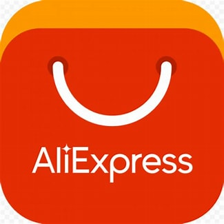

- VLOP és VLOSE teljes lista: https://digital-strategy.ec.europa.eu/en/policies/list-designated-vlops-and-vloses

## Dia 24

- You can simply impress your audience and add a unique zing and appeal to your Presentations. Easy to change colors, photos and Text. Get a modern PowerPoint Presentation that is beautifully designed. You can simply impress your audience and add a unique zing and appeal to your Presentations.
- Get a modern PowerPoint Presentation that is beautifully designed.
- Simple Portfolio
- Presentation Designed
- Illetékes hatóságok és joghatóság megválasztása
- Digitális szolgáltatási koordinátor: A tagállamok a DSA alkalmazásáért és érvényesítéséért felelős illetékes hatóságo(ka)t jelölnek ki, amelyek közül az egyiket digitális szolgáltatási koordinátornak nevezik ki. Magyarországon ezt a feladatot a Nemzeti Média- és Hírközlési Hatóság (NMHH) látja el. A digitális szolgáltatási koordinátorok vizsgálati hatáskörökkel rendelkeznek helyszíni vizsgálatokat folytathatnak le elrendelhetik a jogsértés beszüntetését, bírságot szabhatnak ki és ideiglenes intézkedéseket fogadhatnak el.
- Joghatóság: az üzleti tevékenységének fő helye szerinti tagállam rendelkezik. Amely szolgáltató nem rendelkezik székhellyel az Unióban, de ott szolgáltatásokat kínál, az a jogi képviselő lakóhely vagy székhely tagállamának joghatósága alá tartozik.

## Dia 25

- Szankciók
- 01
- 02
- 03
- 04
- Szankciók szabályait a tagállamok határozzák meg
- DSA nem tartalmaz taxatív felsorolást
- szolgáltató éves jövedelmének vagy árbevételének 6 %-a
- DSA szerinti kötelezettségek megszegése
- szolgáltató éves jövedelmének vagy árbevételének 1 %-a
- Hiányos vagy félrevezető tájékoztatás, helyszíni vizsgálat elutasítása stb.
- szolgáltató előző pénzügyi évi napi átlagos árbevételének 5 %-a
- Kényszerítő, ismétlődő napi bírság

## Dia 26

- Kahoot

## Dia 27

- Az Ekertv. lényegi elemei
- Alapfogalmak, a törvény hatálya
- A szolgáltatással kapcsolatos adatszolgáltatás szabályai
- Az elektronikus szerződéskötés szabályai
- Szolgáltatói felelősségi kérdések – értesítési és eltávolítási eljárás
- Az igénybe vevő adatainak védelme
- 01
- 02
- 03
- 04
- 05

## Dia 28

- Információs tsd-al összefüggő szolgáltatás
- Elektronikus úton, távollevők részére, rendszerint (de nem kizárólag) ellenszolgáltatás fejében nyújtott szolgáltatások, amelyhez a szolgáltatás igénybe vevője egyedileg fér hozzá.
- E-ker szolgáltatás
- Olyan információs társadalommal összefüggő szolgáltatás, amelynek célja valamely birtokba vehető forgalomképes ingó dolog – ideértve a pénzt és az értékpapírt, valamint a dolog módjára hasznosítható természeti erőket –, szolgáltatás, ingatlan, vagyoni értékű jog (a továbbiakban együtt: áru) üzletszerű értékesítése, beszerzése, cseréje vagy más módon történő igénybevétele.

## Dia 29

- Közvetítő szolgáltató: az a szolgáltató, amely az alábbi szolgáltatások valamelyikét nyújtja
- egyszerű továbbítást nyújtó szolgáltató
- olyan szolgáltatás, amely a szolgáltatás igénybe vevője által küldött információnak hírközlő hálózaton keresztül történő továbbításából áll, együtt jár az információ automatikus, közbenső és átmeneti tárolásával, és amelyet azzal a kizárólagos céllal hajtanak végre, hogy az információ későbbi továbbítását a szolgáltatás más igénybe vevői számára azok kérésére hatékonyabbá tegye
- gyorsítótárazás - cashing
- olyan szolgáltatás, amely a szolgáltatás igénybe vevője által küldött és a szolgáltatás igénybe vevőjének kérésére tárolt információ tárolásából áll
- tárhelyszolgáltatás - hosting
- Online keresőprogram-szolgáltató - searching
- információk megtalálását elősegítő segédeszközöket biztosít az igénybe vevő számára
- olyan szolgáltatás, amely a szolgáltatás igénybe vevője által küldött információnak hírközlő hálózaton keresztül történő továbbításából vagy a hírközlő hálózathoz való hozzáférés biztosításából áll

## Dia 30

- Az Ekertv. területi hatálya
- Magyarország területére irányulóan nyújtott szolgáltatás
- Ha a szolgáltatásról a használt nyelv, a pénznem és egyéb körülmények alapján valószínűsíthető, hogy magyarországi igénybe vevők számára kívánják elérhetővé tenni
- Bármely, Magyarország területéről nyújtott szolgáltatás
- Magyarország területén lévő székhelyén, telephelyén vagy lakóhelyén az adott információs társadalommal összefüggő szolgáltatással kapcsolatos tényleges tevékenységet végző szolgáltató

## Dia 31

- Az Ekertv. személyi hatálya
- Aki a szolgáltatást nyújtja.
- Természetes vagy jogi személy, vagy jogi személyiség nélküli más szervezet.
- SZOLGÁLTATÓ
- Aki/amely információs társadalommal összefüggő szolgáltatást vesz igénybe.
- Természetes vagy jogi személy, vagy jogi személyiség nélküli más szervezet.
- IGÉNYBE VEVŐ

## Dia 32

- Az Ekertv. tárgyi hatálya
- Információs társadalommal összefüggő szolgáltatás
- Nem terjed ki olyan közlésekre, amelyet gazdasági, szakmai tevékenység vagy közfeladat körén kívül eső célból eljáró́ személy (fogyasztó́) tesz információs társadalommal összefüggő szolgáltatás igénybevételével
- Pl.: chatszobában írott közlés, a közösségi oldalon tett kommentek, jogi iroda profilja a Facebookon, esküvői videó feltöltése a YouTube-ra

## Dia 33

- Az előzetes engedélyezést kizáró elv
- Nem szükséges engedély az információs társadalommal összefüggő szolgáltatások nyújtásának megkezdéséhez vagy folytatásához.
- Ez nem jelenti, hogy ne kellhetne valamilyen engedély az ilyen szolgáltatás útján végzett tevékenységhez (pl. gyógyszerek forgalomba hozatali engedélye).
- DE: EGT területéről Mo-ra irányuló szolgáltatás nem korlátozható (kivéve közrend, közbiztonság, közegészségügy, fogyasztók védelme).

## Dia 34

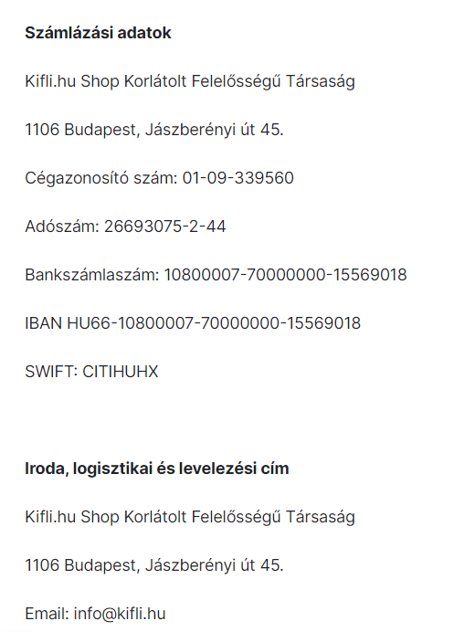

- Szolgáltatói adatszolgáltatás
- Kötelező adatszolgáltatás (azon adatok, amiknek közvetlenül, folyamatosan és könnyen elérhetőnek kell lenniük a szolgáltatás honlapján)
- Név, székhely, telephely, elérhetőség (e-mail!)
- Nyilvántartásba vevő bíróság/hatóság, nyilvántartási szám (ha nyilv.tartásba vételhez kötött szolg.)
- Engedélyező hatóság neve, elérhetősége, engedély száma (ha engedélyhez kötött szolg.)
- Adószám, ha ÁFA alany

## Dia 35

- Elektronikus szerződéskötés
- Az ÁSZF-et olyan módon kell hozzáférhetővé tenni, amely lehetővé teszi az igénybe vevő számára, hogy tárolja és előhívja azokat.
- Szolgáltató tájékoztatási kötelezettsége:
- Szerződéskötés technikai lépéseiről szerződés írásba foglalt szerződésnek minősül-e, a szolgáltató iktatja-e a szerződést, illetve, hogy az iktatott szerződés utóbb hozzáférhető lesz-e az adatbeviteli hibáknak a szerződéses nyilatkozat elküldését megelőzően történő azonosításához és kijavításához biztosított eszközök a szerződéskötés lehetséges nyelveiről a szolgáltatási tevékenységére vonatkozó magatartási kódexről
- A szolgáltató köteles az igénybe vevő megrendelésének megérkezését az igénybe vevő felé elektronikus úton haladéktalanul (max. 48 órán belül) visszaigazolni. Ha ez nem történik meg, mentesül az igénybe vevő mentesül az ajánlati kötöttség/szerződéses kötelezettség alól.

## Dia 36

- Felelősségi kérdések
- A szolgáltató felelős a szolgáltatásán keresztül hozzáférhetővé tett információért. Nem felel, ha nem tud a jogsértésről és felszólításra eltávolítja a jogsértő tartalmat.
- Az egyszerű továbbítást nyújtó, a gyorsítótárazást nyújtó és a tárhelyszolgáltatást nyújtó szolgáltatóra további, a felelősségre és a felelősség alóli mentesülésre vonatkozó szabályokat a DSA rendelet (4-6. cikk) tartalmazza.
- Az online keresőprogram szolgáltató akkor nem felel az általa nyújtott szolgáltatás keretében az információ hozzáférhetővé tételével okozott kárért, ha a) nincs tudomása az információval kapcsolatos jogellenes magatartásról, vagy arról, hogy az információ bárkinek a jogát vagy jogos érdekét sérti; b) amint az a) pontban foglaltakról tudomást szerzett, haladéktalanul intézkedik az elérési információ eltávolításáról vagy a hozzáférés megtiltásáról.

## Dia 37

- A közvetítő szolgáltatónak a DSA rendelet 4–6. cikk alapján történő mentesülése nem zárja ki azt, hogy az a személy, akit a jogellenes tartalmú információ révén sérelem ért, a jogsértésből fakadó igényei közül a jogsértés megelőzésére vagy abbahagyására irányuló követeléseit a jogsértő fél mellett a közvetítő szolgáltatóval szemben is bíróság útján érvényesítse.
- A közvetítő szolgáltatóra nem vonatkozik olyan általános kötelezettség, amelynek értelmében nyomon kellene követnie az általa továbbított vagy tárolt információkat, vagy jogellenes tevékenységre utaló tények vagy körülmények aktív feltárására kellene törekedniük.
- Felelősségi kérdések

## Dia 38

- Az Eker. tv. 2014. január 1. óta biztosítja az eljárás igénybevételét a szerzői és szomszédos jogok sérelme, valamint védjegyjogi védelem alatt álló szellemi alkotások megsértése esetén. Az a jogosult, akinek a szerzői jogi törvény által védett szerzői művén, előadásán, hangfelvételén, műsorán, audiovizuális művén, adatbázisán fennálló jogát (szomszédos jog), továbbá a védjegyek és a földrajzi árujelzők oltalmáról szóló törvényben meghatározott, a védjegyoltalomból eredő kizárólagos jogát a szolgáltató által hozzáférhetővé tett információ – ide nem értve a hozzáférhetővé tett információ szabványosított címét (doménnév) – sérti, teljes bizonyító erejű magánokiratba, vagy közokiratba foglalt értesítésével felhívhatja a gyorsítótárolást nyújtó és a tárhelyszolgáltatót a szerzői, szomszédos jogát, vagy védjegyoltalomból fakadó jogát sértő tartalom eltávolítására. A törvény a szellemi alkotások jogán túl egy további jogsértés tekintetében is lehetővé teszi az értesítési-eltávolítási eljárás igénybevételét, éspedig a kiskorúak személyiségi jogát sértő, a szolgáltató által hozzáférhetővé tett tartalom tekintetében. Az eljárás célja elsősorban, hogy az ilyen jellegű, rövid időn belül jelentékeny kárt okozó jogellenes tartalmakat rövid időn belül el lehessen távolítani, a további jogsértést, és károkozást meg lehessen szüntetni.
- Értesítési-eltávolítási eljárás

## Dia 39

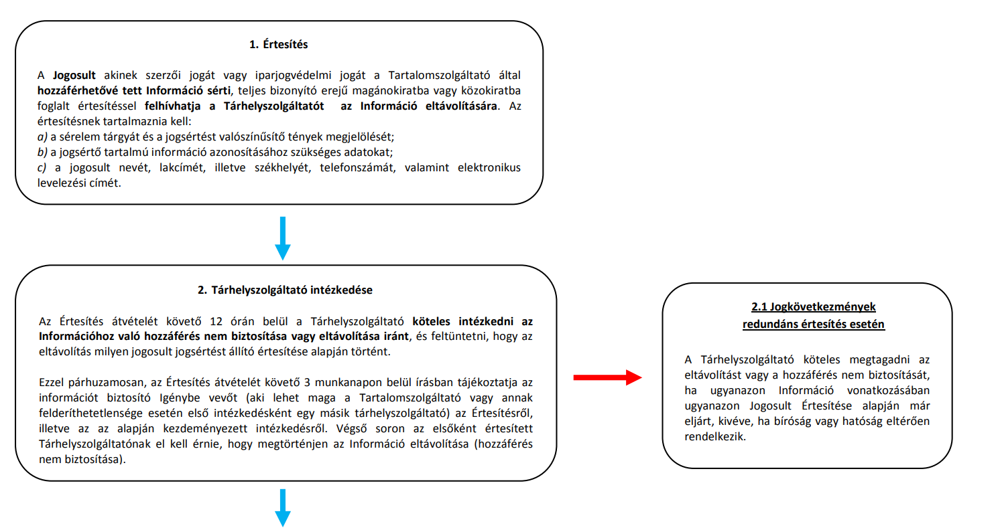

- Értesítési-eltávolítási eljárás I.

## Dia 40

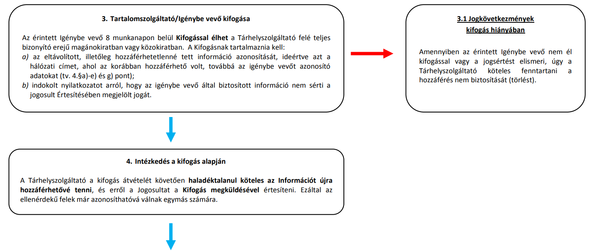

- Értesítési-eltávolítási eljárás II.

## Dia 41

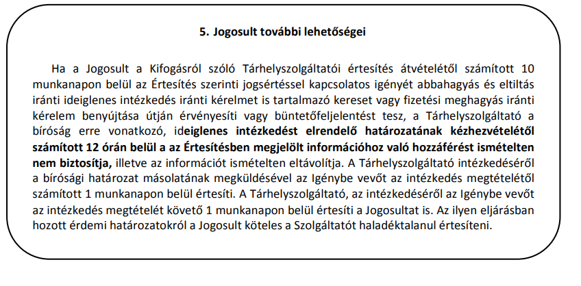

- Értesítési-eltávolítási eljárás III.

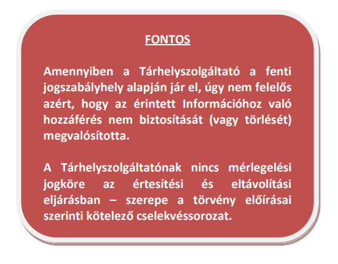

- Értesítési-eltávolítási eljárás I-III. forrás: https://www.iszt.hu/app/uploads/2020/06/ertesit-eltavolit-folyamat.pdf

## Dia 42

- Adatvédelem
- A szolgáltató az információs társadalommal összefüggő szolgáltatás nyújtására irányuló szerződés létrahozása, tartalmának meghatározása, módosítása, teljesítésének figyelemmel kísérése, az ebből származó díjak számlázása, valamint az azzal kapcsolatos követelmények érvényesítése céljából kezelheti az igénybe veő azonosításához szükséges természetes személyazonosító adatokat és lakcímet.
- Egyéb célból (pl. a szolgáltatás hatékonyságának növelése, hirdetés vagy egyéb tartalom eljuttatása, piackutatás) céljából csak a cél előzetes meghatározása mellett, az igénybe vevő hozzájárulása alapján kezelhet.
- Biztosítani kell, hogy az igénybe vevő az adathasználatot bármikor megtilthassa.
- Adatvédelem

## Dia 43

- Médiatartalomnak nem minősülő információ, amely kiskorúak szellemi, erkölcsi, fizikai fejlődését súlyosan károsíthatja (különösen azáltal, hogy meghatározó eleme az erőszak, illetve a szexualitás közvetlen, naturális ábrázolása)
- Kiskorúak védelme
- Előzetes figyelmeztető jelzés
- Forráskódban szűrőprogramok által felismerhető jelzés
- Médiatv. alapján

## Dia 44

- Köszönöm szépen a figyelmet.

